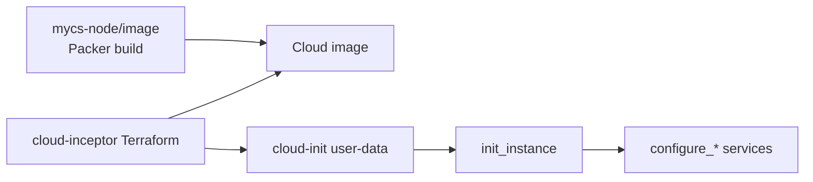

# Bastion Automation Appliance

Templates and build tooling for a secured bastion appliance used to automate cloud deployments. Images are built with [Packer](https://www.packer.io/) and configured at first boot by bootstrap scripts baked into the image. Terraform modules in [`cloud-inceptor`](https://github.com/novassist-ai/mycs-node.git/cloud) deploy instances from these images and supply runtime configuration via cloud-init.

The appliance provides secure VPC access (OpenVPN, WireGuard, or IPsec), optional HTTP proxying, internal DNS, SMTP relay, Docker workloads, optional site-to-site VPN gateway peering, and the MyCloudSpace node control plane (Tailscale/Headscale mesh, API, and automation hooks).

---

## Table of Contents

- [Overview](#overview)
- [Repository Layout](#repository-layout)
- [Design Documentation](#design-documentation)
- [Prerequisites](#prerequisites)
- [Usage](#usage)
  - [Common build settings](#common-build-settings)
  - [Local builds by cloud](#local-builds-by-cloud)
  - [Production builds (GitHub Actions)](#production-builds-github-actions)
  - [Docker build environment](#docker-build-environment)
  - [Release tagging](#release-tagging)
- [Runtime Configuration](#runtime-configuration)
- [Bootstrap Scripts](#bootstrap-scripts)
- [Build Troubleshooting](#build-troubleshooting)
- [Related Repositories](#related-repositories)
- [License](#license)

---

## Overview

This repository produces a **base machine image** — not a running service. The image contains:

1. **Pre-installed packages** — VPN, DNS, proxy, mail, Docker, MyCloudSpace node binaries, and supporting tools (all services **stopped and disabled** until runtime configuration).
2. **Bootstrap scripts** under `/usr/local/lib/cloud-inceptor/` that configure services on first boot from `/etc/mycs/config.yml`.
3. **Static web assets** under `/var/www/html/` (VPN client installers, directory listings, error pages).

Deployment is handled by `cloud-inceptor` Terraform, which selects the cloud image, injects `bastion-config.yml`, TLS material, SSH keys, and triggers `init_instance` on first boot.



For build-time vs runtime details see [docs/build-design.md](docs/build-design.md) and [docs/runtime-bootstrap-design.md](docs/runtime-bootstrap-design.md).

---

## Repository Layout

```
mycs-node/image/
├── build/                      # Cloud-specific build, publish, delete wrappers
├── packer/                     # Packer manifests (HCL; JSON legacy equivalents)
├── scripts/
│   ├── config/                 # Bootstrap scripts → /usr/local/lib/cloud-inceptor/
│   └── ovh/                    # OVH OpenStack build helpers
├── www/                        # Static content → /var/www/html
├── docker/                     # Optional containerised build environment
├── docs/                       # Design documentation (see below)
└── .github/workflows/          # CI build and publish pipelines
```

| Path | Purpose |
|------|---------|
| `build/build-*-image.sh` | Prepare artifacts, invoke Packer, write log files |
| `build/publish-*-image.sh` | Copy images to additional regions |
| `build/delete-*-images.sh` | Remove images by version |
| `scripts/config/install_packages` | **Build-time only** — installs all packages and lays down scripts |
| `scripts/config/init_instance` | **First boot** — orchestrates all `configure_*` scripts |
| `packer/build-*.pkr.hcl` | Packer templates per cloud target |

Ephemeral directories (not committed): `.download/` (mycs-node zip, API key), `.build/` (Vagrant/OVH exports).

---

## Design Documentation

| Document | Description |
|----------|-------------|
| [docs/build-design.md](docs/build-design.md) | Packer flow, build scripts, `install_packages`, CI, build troubleshooting |
| [docs/runtime-bootstrap-design.md](docs/runtime-bootstrap-design.md) | `init_instance`, configure script order, idempotency |
| [docs/network-design.md](docs/network-design.md) | Interfaces, nftables, routing, Docker bypass, `direction` summary, network troubleshooting |
| [docs/ipsec-vpn-connectivity-design.md](docs/ipsec-vpn-connectivity-design.md) | IPsec road-warrior + VPN gateway connectivity, Peer A/B, reachability |
| [docs/dns-design.md](docs/dns-design.md) | PowerDNS, DNSDist, Pi-hole |
| [docs/vpn-design.md](docs/vpn-design.md) | Road-warrior VPN (OpenVPN, WireGuard, StrongSwan IKEv2) |
| [docs/vpn-gateway-design.md](docs/vpn-gateway-design.md) | Site-to-site IPsec peers, peering, gateway troubleshooting |
| [docs/build.md](docs/build.md) | Legacy YAML schema reference (OpenVPN, Squid, Concourse) |
| [docs/git-crypt.md](docs/git-crypt.md) | git-crypt key injection on bastion hosts |

---

## Prerequisites

| Tool | Used by |
|------|---------|
| [Packer](https://www.packer.io/) ≥ 1.8 | All builds |
| [AWS CLI](https://aws.amazon.com/cli/) | AWS builds; dev artifact download (all clouds) |
| [GitHub CLI](https://cli.github.com/) (`gh`) | Prod mycs-node release download |
| [jq](https://stedolan.github.io/jq/) | Build scripts |
| [Google Cloud SDK](https://cloud.google.com/sdk/) | GCP builds |
| [Azure CLI](https://learn.microsoft.com/en-us/cli/azure/) | Azure builds |
| [OpenStack CLI](https://docs.openstack.org/python-openstackclient/) | OVHcloud builds |
| [Vagrant](https://www.vagrantup.com/) + VirtualBox | Vagrant box builds |

Initialize Packer plugins before the first build:

```bash
cd packer && packer init build-aws.pkr.hcl   # or your target cloud
```

---

## Usage

Run build scripts from the `image/` directory (or any directory). Logs are written to the current working directory (e.g. `build-aws-us-east-1.log`).

### Common build settings

| Variable | Default | Description |
|----------|---------|-------------|
| `IS_DEV_BUILD` | `yes` | `yes` → mycs-node from S3; `no` → GitHub release |
| `MYCS_ENV` | `dev` / `prod` | DynamoDB `AppConfig` prefix for API public key |
| `MYCS_NODE_VER` | `latest` | GitHub release tag when `IS_DEV_BUILD=no` |

Dev builds require **AWS credentials** (even for GCP/Azure/OVH) to download S3 artifacts and DynamoDB keys.

### Local builds by cloud

| Cloud | Build command | Publish |
|-------|---------------|---------|
| **AWS** | `./build/build-aws-image.sh us-east-1 1.2.3` | `./build/publish-aws-image.sh us-east-1 1.2.3` |
| **Google** | `./build/build-google-image.sh 1.2.3` | `./build/publish-google-image.sh 1.2.3` |
| **Azure** | `./build/build-azure-image.sh 1.2.3 eastus` | `./build/publish-azure-image.sh eastus 1.2.3 all` |
| **OVHcloud** | `source openrc.sh && ./build/build-ovh-image.sh 1.2.3 UK1` | `./build/publish-ovh-image.sh UK1 1.2.3 all` |
| **Vagrant** | `./build/build-vagrant-image.sh 1.2.3` | *(Vagrant Cloud)* |

Image naming, credentials, and full option reference: [docs/build-design.md](docs/build-design.md).

**Quick AWS example:**

```bash
export AWS_ACCESS_KEY_ID=...
export AWS_SECRET_ACCESS_KEY=...
export AWS_DEFAULT_REGION=us-east-1
./build/build-aws-image.sh us-east-1 D.251123055007
```

**Quick OVH example:**

```bash
export OS_OPENRC_FILE=/path/to/openrc.sh
source "$OS_OPENRC_FILE"
./build/build-ovh-image.sh 1.2.3 UK1
```

### Production builds (GitHub Actions)

| Workflow | Trigger | What it builds |
|----------|---------|----------------|
| [`build-image-dev.yml`](../.github/workflows/build-image-dev.yml) | Push to `dev` (paths: `image/build/`, `image/packer/`, `image/scripts/`, `image/www/`) | AWS AMI `D.YYMMDDHHMMSS`; publishes to multiple regions |
| [`build-image-prod.yml`](../.github/workflows/build-image-prod.yml) | Push to `main` | Semver tag `0.1.N`; AWS + Azure + GCP with `IS_DEV_BUILD=no` |

Both workflows trigger downstream builds in related repositories after image publish.

Manual dispatch: **Actions → Build dev/prod Bastion Images → Run workflow**.

Required secrets: `AWS_ACCESS_KEY_ID`, `AWS_SECRET_ACCESS_KEY`, `GH_TOKEN`, plus cloud-specific secrets for prod Azure/GCP.

### Docker build environment

Optional Ubuntu container with Packer and cloud CLIs:

```bash
cd docker
./build-image.sh
./build-image.sh publish REPO USER PASSWORD   # push to registry
```

Mount the repo and run `./build/build-*-image.sh` inside the container. See [docs/build-design.md](docs/build-design.md#docker-build-environment).

### Release tagging

```bash
./build/create-release.sh 1.2.3   # merge to master, tag, push — run from non-master branch
```

---

## Runtime Configuration

Runtime configuration is **not** baked into the image. Terraform in `cloud-inceptor` (`modules/bastion-config/bastion.tf`) generates `config.yml` and delivers it as `/usr/local/etc/bastion-config.yml` via cloud-init. `init_instance` moves it to `/etc/mycs/config.yml`.

| Section | Configures |
|---------|------------|
| `server` | Hostname, FQDN, NIC layout, admin credentials |
| `vpn` | Road-warrior VPN type, subnet, users |
| `vpn_gateway` | Site-to-site gateway enablement and global IKE identity |
| `powerdns` | Internal DNS zones and records |
| `data` | Attached volume mount (`/data`) |
| `services` / `mycs` | MyCloudSpace node and mesh |

VPN gateway **peers** are added post-deploy via `manage_vpn_gateway_peer` — see [docs/vpn-gateway-design.md](docs/vpn-gateway-design.md).

---

## Bootstrap Scripts

Installed to `/usr/local/lib/cloud-inceptor/`.

| Script | Purpose |
|--------|---------|
| `install_packages` | Build-time only |
| `init_instance` | First-boot orchestrator |
| `configure_network` | netplan, nftables, forwarding |
| `configure_powerdns` | PowerDNS + Pi-hole |
| `configure_strongswan` | IKEv2 road-warrior server |
| `configure_vpn_gateway` | Site-to-site gateway bootstrap |
| `manage_vpn_gateway_peer` | Runtime peer management |
| `configure_openvpn` / `configure_wireguard` | Alternative road-warrior VPNs |
| `configure_docker` / `configure_apache` / `configure_smtp` / `configure_mycsnode` | Supporting services |

Full list and execution order: [docs/runtime-bootstrap-design.md](docs/runtime-bootstrap-design.md).

---

## Build Troubleshooting

| Symptom | Likely cause | Fix |
|---------|--------------|-----|
| `packer: plugin not found` | Packer init not run | `cd packer && packer init build-<cloud>.pkr.hcl` |
| `install_packages` apt timeout | cloud-init still updating apt | Retry build; check builder network |
| Missing mycs-node zip | AWS creds or S3 path | Verify `IS_DEV_BUILD`, region, DynamoDB access |
| OVH auth failure | OpenStack env not loaded | `source openrc.sh && openstack token issue` |
| Wrong AWS architecture | ARM64 build on x86 base | AWS uses `arm64` / `t4g.micro` — see [build-design.md](docs/build-design.md) |
| Empty build log | Wrong working directory | Run scripts from `image/` or note CWD for log path |

Detailed build troubleshooting: [docs/build-design.md](docs/build-design.md#build-troubleshooting).

Runtime/network/VPN troubleshooting: [docs/network-design.md](docs/network-design.md#troubleshooting), [docs/vpn-gateway-design.md](docs/vpn-gateway-design.md#troubleshooting).

---

## License

This module is part of [mycs-node](https://github.com/novassist-ai/mycs-node) and is licensed under the [GNU General Public License v3.0](../LICENSE).
