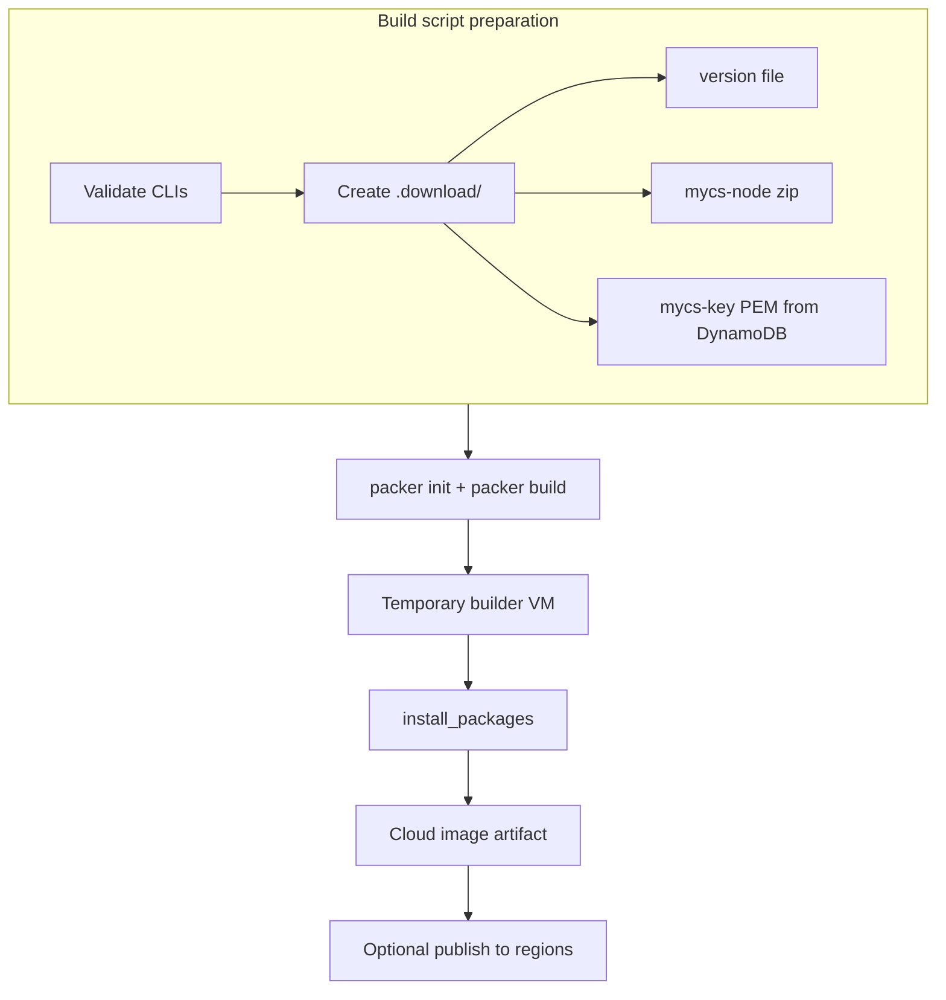

# Bastion Image Build Design

This document describes how machine images in the `mycs-node/image` module are built, what is baked into the base image at build time, and how build artifacts flow to each target cloud.

---

## Table of Contents

1. [Overview](#overview)
2. [Build Scripts and Cloud Targets](#build-scripts-and-cloud-targets)
3. [Packer Templates](#packer-templates)
4. [Build Flow](#build-flow)
5. [install_packages — Base Image Provisioning](#install_packages--base-image-provisioning)
6. [Docker Build Environment](#docker-build-environment)
7. [MyCloudSpace Node Artifact Sources](#mycloudspace-node-artifact-sources)
8. [Image Naming and Artifacts](#image-naming-and-artifacts)
9. [GitHub Actions CI](#github-actions-ci)
10. [Build Troubleshooting](#build-troubleshooting)

---

## Overview

The bastion appliance image is produced in **two phases**:

| Phase | When | What happens |
|-------|------|----------------|
| **Build time** | Packer run on a temporary VM | Packages installed, scripts laid down, services disabled, image sealed |
| **Runtime** | First boot via `cloud-inceptor` Terraform | `init_instance` reads `/etc/mycs/config.yml` and runs `configure_*` scripts |

Build-time work is intentionally **generic**: no environment-specific VPN peers, DNS zones, or network layout are baked in. Those are supplied at runtime through Terraform-generated YAML and cloud-init.

---

## Build Scripts and Cloud Targets

All build wrappers live under `build/`. Each script prepares `.download/`, invokes Packer, and writes a log file in the current working directory.

| Script | Cloud / target | Packer manifest | Architecture | Base image |
|--------|----------------|-----------------|--------------|------------|
| `build-aws-image.sh` | AWS EC2 AMI | `packer/build-aws.pkr.hcl` | `arm64` (`t4g.micro`) | Ubuntu Noble via [cloud-images locator](https://cloud-images.ubuntu.com/locator/) |
| `build-google-image.sh` | Google Compute Engine | `packer/build-google.pkr.hcl` | `amd64` | `ubuntu-2204-lts` family |
| `build-azure-image.sh` | Azure managed image | `packer/build-azure.pkr.hcl` | `amd64` | Canonical Ubuntu 22.04 LTS Gen2 |
| `build-ovh-image.sh` | OVH Public Cloud (OpenStack) | `packer/build-openstack.pkr.hcl` | `amd64` (`d2-2`) | OVH `Ubuntu 24.04` Glance image |
| `build-vagrant-image.sh` | Vagrant Cloud box | `packer/build-vagrant.pkr.hcl` | `amd64` | `ubuntu/jammy64` |

**Publish scripts** copy built images to additional regions:

| Script | Mechanism |
|--------|-----------|
| `publish-aws-image.sh` | `ec2 copy-image` + public launch permission |
| `publish-google-image.sh` | Copy tarball between regional GCS buckets |
| `publish-azure-image.sh` | Copy snapshot VHD to per-region storage accounts |
| `publish-ovh-image.sh` | Export QCOW2 from source region, upload to destination Glance |

**Delete scripts** remove old images by version pattern: `delete-{aws,azure,google,ovh,vagrant}-images.sh`.

**Other:**

| Script | Purpose |
|--------|---------|
| `create-release.sh` | Merge feature branch to `master`, create semver tag, push |

OVH-specific helpers: `scripts/ovh/common.sh` (OpenStack auth, image naming, ID resolution).

---

## Packer Templates

Primary manifests are HCL (`packer/*.pkr.hcl`); legacy JSON equivalents exist for some targets.

Every public-cloud template uses the **same provisioner sequence**:

```
file  .download/           → /tmp/download
file  scripts/config/      → /tmp/inceptor-scripts
file  www/                 → /tmp/www-static-home
shell chmod +x + install_packages
```

Example (AWS):

```hcl
provisioner "file" {
  source      = "${var.build_dir}/.download"
  destination = "/tmp/download"
}
provisioner "shell" {
  expect_disconnect = false
  inline = [
    "chmod +x /tmp/inceptor-scripts/*",
    "/tmp/inceptor-scripts/install_packages"
  ]
}
```

Run `packer init packer/build-<cloud>.pkr.hcl` before the first build to install required plugins (`amazon`, `googlecompute`, `azure`, `openstack`, `vagrant`, etc.).

---

## Build Flow



**Build script preparation** (common to AWS, GCP, Azure, OVH):

1. Validate required CLIs (`aws`, `gh`, `jq`, cloud-specific tools).
2. Create `.download/` containing:
   - `version` — image version string passed as script argument.
   - `mycs-node-service_linux_{arch}.zip` — from S3 (dev) or GitHub releases (prod).
   - `mycs-key-{id}.pem` — MyCloudSpace API public key from DynamoDB `AppConfig`.
3. Delete any existing image with the same name (region-local).
4. Invoke `packer build` with cloud-specific variables.

---

## install_packages — Base Image Provisioning

`scripts/config/install_packages` runs **once** on the Packer builder VM as root. It is not re-run at instance first boot.

### Pre-install

- Waits up to 180s for cloud-init to finish (`/var/lib/cloud/instance/boot-finished`).
- Adds third-party apt repositories: Docker, OpenVPN 2.7, Apache (Sury), deadsnakes Python, PowerDNS, WireGuard, StrongSwan.
- Disables stock `nftables.service` (bastion manages its own ruleset via `configure_network` and `rc.local`).

### Packages and services installed (all stopped/disabled at build time)

| Category | Components |
|----------|------------|
| **Network** | nftables, isc-dhcp-server, net-tools, ipcalc |
| **DNS** | pdns-server, pdns-recursor, dnsdist, Pi-hole Docker image (saved tarball) |
| **VPN** | OpenVPN 2.7, WireGuard, charon-systemd, strongswan-swanctl, strongswan-pki, easy-rsa |
| **VPN utilities** | udp-speeder, udp2raw, kcptun-server (compiled from source) |
| **Web** | Apache 2, pwauth, mod-authnz-external |
| **Mail** | Postfix, mailutils, SPF policy |
| **Proxy** | Squid |
| **Containers** | Docker CE; pre-built Pi-hole and OpenSSL 1.1.1 Docker images saved as tarballs |
| **Mesh / control plane** | mycs-node, mycs-daemon, tailscale, tailscaled, headscale (from release zip) |
| **Security / ops** | certbot, unattended-upgrades, OpenVPN Connect installers (served from `/var/www/html`) |
| **Languages** | Python 3 (deadsnakes), build-essential, cmake |

### MyCloudSpace node installation

From `/tmp/download/mycs-node-service_linux_{arch}.zip`:

- Extracts `mycs-node`, `mycs-daemon`, `tailscale`, `tailscaled`, `headscale` → `/usr/local/bin/`
- Creates systemd units for `mycs-node`, `mycs-daemon`, `tailscaled` (all **disabled**)
- Writes Headscale config under `/etc/headscale/`
- Installs API public key from `/tmp/download/mycs-key-*.pem`

### Bootstrap script layout

| Source (repo) | Image path |
|---------------|------------|
| `scripts/config/*` | `/usr/local/lib/cloud-inceptor/` |
| Symlinks in `/usr/local/bin/` | CLI entry points (`manage_vpn_gateway_peer`, `create_vpn_user`, etc.) |
| `scripts/config/rc.local` | `/etc/rc.local` |
| `www/` | `/var/www/html/` |

### Image hygiene (end of install_packages)

- Removes SSH host keys, bash history, apt cache.
- Runs `cloud-init clean` so instances get fresh instance IDs on launch.
- Truncates `/etc/machine-id`.

### Subsystems configured at runtime (not build time)

These have packages/binaries installed but **no live configuration** until `init_instance` runs the matching `configure_*` script:

| configure_* script | Build-time preparation |
|---------------------|------------------------|
| `configure_network` | nftables, dhcp packages |
| `configure_powerdns` | PowerDNS, dnsdist, Pi-hole tarball |
| `configure_openvpn` | OpenVPN, easy-rsa, client installers |
| `configure_strongswan` | charon-systemd, swanctl, strongswan-pki |
| `configure_wireguard` | wireguard tools |
| `configure_vpn_gateway` | Same StrongSwan stack; peer dirs created at runtime |
| `configure_docker` | Docker CE (disabled) |
| `configure_apache` | Apache (disabled) |
| `configure_smtp` | Postfix (disabled) |
| `configure_squidproxy` | Squid (disabled) |
| `configure_mycsnode` | mycs-node binaries and systemd units |

See [runtime-bootstrap-design.md](runtime-bootstrap-design.md) for first-boot orchestration.

---

## Docker Build Environment

`docker/` provides an optional Ubuntu container with build tooling pre-installed for consistent local builds:

| File | Purpose |
|------|---------|
| `Dockerfile` | Base image with Packer, AWS/Azure/GCP CLIs, jq |
| `prepare-image.sh` | Installs apt packages and downloads Packer inside the container |
| `build-image.sh` | Builds local image; optional `publish REPO USER PASSWORD` |

Use when the host OS lacks a consistent toolchain. Mount the repository and run build scripts from inside the container with cloud credentials exported.

---

## MyCloudSpace Node Artifact Sources

| `IS_DEV_BUILD` | mycs-node source | API key source |
|----------------|------------------|----------------|
| `yes` (default) | `s3://mycsdev-{region}-deploy-artifacts/releases/mycs-node-service_linux_{arch}.zip` | DynamoDB `mycs{MYCS_ENV}_AppConfig` |
| `no` | GitHub release `novassist-ai/mycs-node` (`MYCS_NODE_VER`, default `latest`) | Same DynamoDB lookup |

Dev builds require **AWS credentials** even when building GCP, Azure, or OVH images (artifact and key download).

---

## Image Naming and Artifacts

| Cloud | Image name pattern | Notes |
|-------|-------------------|-------|
| AWS | `mycs-node-image_{version}` | ARM64 AMI |
| GCP | `mycs-node-image-{version}` | Dots → hyphens; exported `.tar.gz` to GCS under `mycs-node-image/` |
| Azure | `mycs-node-image-{env}_{location}` | Snapshot: `mycsnodeimage_{version}` |
| OVH | `mycs-node-image_{version}` | Private Glance image; QCOW2 export for publish |
| Vagrant | `mycloudspace/mycs-node-image` | VirtualBox box on Vagrant Cloud |

Log files: `build-{cloud}-{region}.log` in the directory where the build script is invoked.

---

## GitHub Actions CI

| Workflow | Trigger | Branch | Builds |
|----------|---------|--------|--------|
| `build-image-dev.yml` | Push to `dev` (paths under `image/`) or manual | `dev` | AWS only |
| `build-image-prod.yml` | Push to `main` or manual | `main` | AWS only |
| `build-vpn-node-builder-dev.yml` | Push/PR to `dev`, manual, or bastion-dev dispatch | `dev` | Docker smoke (`:dev`, bastion `X.Y.Z-devN`) |
| `build-vpn-node-builder-prod.yml` | Push to `main`, manual, or bastion-prod dispatch | `main` | Docker smoke (`:latest` / version, bastion semver) |

**Dev workflow:**

1. Runs `cicd/scripts/generate-version.sh` → tag/AMI `mycs-node-image_X.Y.Z-devN`.
2. Builds in `us-east-1`, publishes to additional AWS regions.
3. Pushes the git tag after a successful build.
4. Dispatches `build-vpn-node-builder-dev.yml` with that bastion image name.

Local CLI may build a fixed `mycs-node-image_dev`; Actions uses semver-dev tags.

**Prod workflow:**

1. Auto-increments git tag `mycs-node-image_0.0.N` on `main`.
2. Sets `IS_DEV_BUILD=no` and downloads mycs-node from `novassist-ai/mycs-node` releases.
3. Builds and publishes the AWS AMI `mycs-node-image_0.0.N`.
4. Dispatches `build-vpn-node-builder-prod.yml` with that image name.

Required secrets: `AWS_ACCESS_KEY_ID`, `AWS_SECRET_ACCESS_KEY`, `GH_TOKEN`.

---

## Build Troubleshooting

### Packer plugin not found

```bash
cd packer
packer init build-aws.pkr.hcl   # or target cloud
```

### cloud-init / apt timeout during install_packages

The script waits 180s for `/var/lib/cloud/instance/boot-finished`. If Packer fails during provisioning:

- Check builder instance can reach Ubuntu mirrors (IPv4 forced via `-o Acquire::ForceIPv4=true`).
- Retry the build; transient mirror issues are common.

### Missing mycs-node or API key

Dev builds require AWS credentials with:

- `s3:GetObject` on `mycsdev-*-deploy-artifacts`
- `dynamodb:Query` on `mycs{MYCS_ENV}_AppConfig`

Prod builds require `gh auth` with access to `novassist-ai/mycs-node` releases.

### OVH OpenStack auth failures

```bash
export OS_OPENRC_FILE=/path/to/openrc.sh
source "$OS_OPENRC_FILE"
openstack token issue
pip install python-openstackclient
packer plugins install github.com/hashicorp/openstack
```

### AWS AMI build wrong architecture

AWS builds target **ARM64** (`t4g.micro`, `OSARCH=arm64`). Ensure the Ubuntu base AMI from the locator matches `arm64`.

### Build log location

Each wrapper writes to the **current working directory**, not the `image/` directory unless you `cd` there first:

```bash
cd /path/to/mycs-node/image
./build/build-aws-image.sh us-east-1 1.2.3
# log: build-aws-us-east-1.log
```

### Inspecting a failed Packer VM

If Packer leaves a builder instance running, SSH to it (when possible) and inspect `/var/log/cloud-init-output.log` and the Packer shell provisioner output.

Shell provisioners use `expect_disconnect = false` so an unexpected SSH drop during `install_packages` fails the build instead of snapshotting a partial image. `install_packages` also runs `apt-mark manual networkd-dispatcher` before `apt autoremove` so golang cleanup does not remove that package and drop SSH on EC2.

---

## Related Documentation

- [README.md](../README.md) — Repository overview and usage
- [runtime-bootstrap-design.md](runtime-bootstrap-design.md) — First-boot `init_instance` flow
- [network-design.md](network-design.md) — Runtime network configuration
