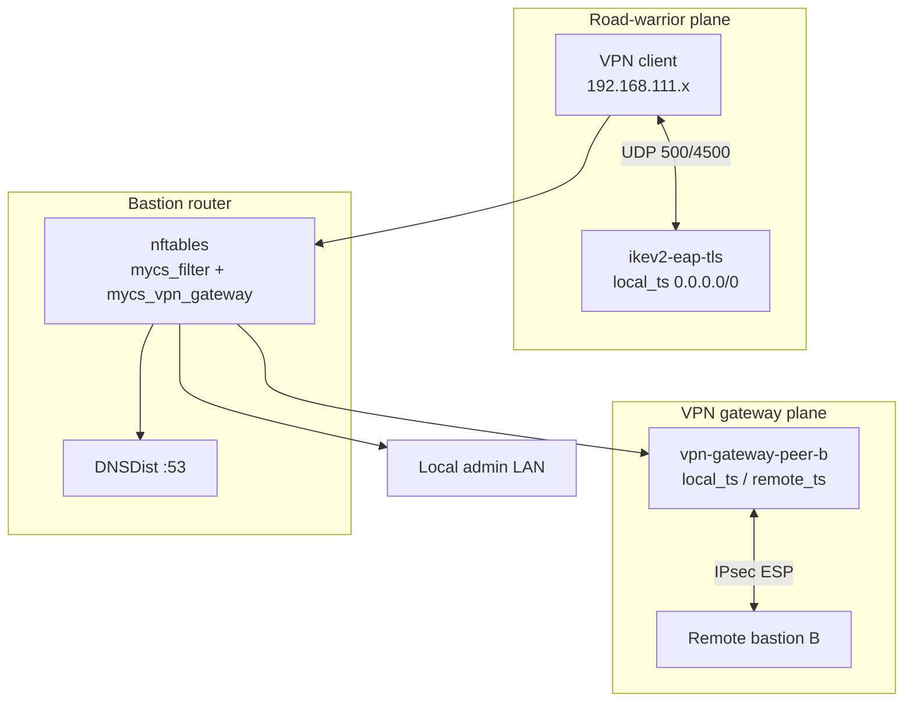
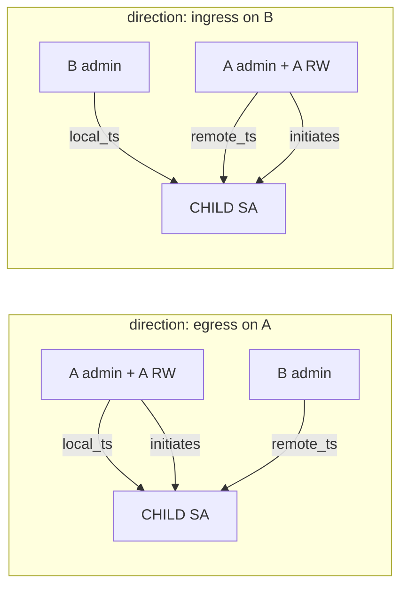
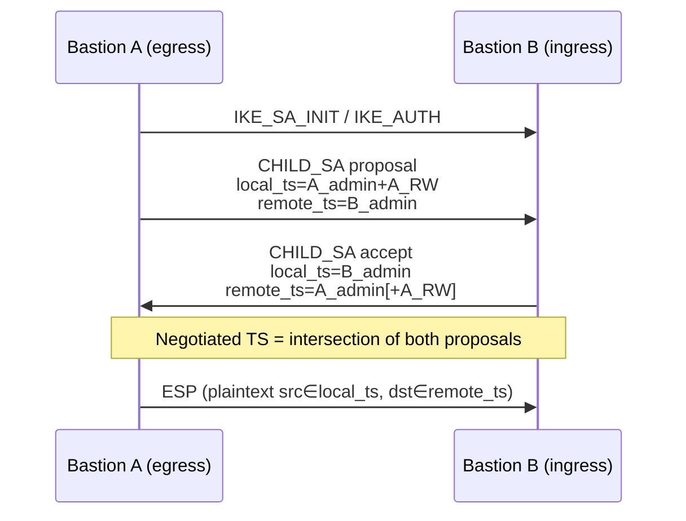
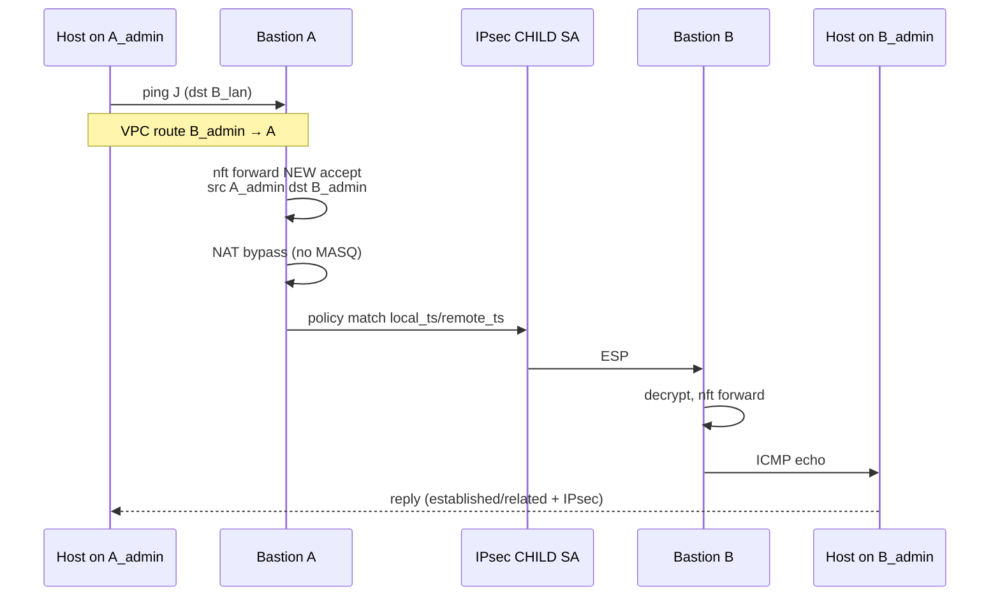
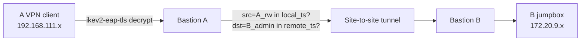
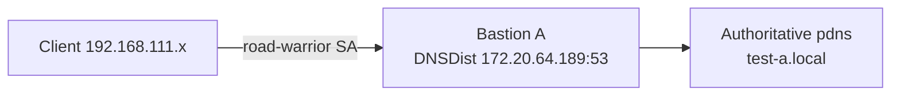
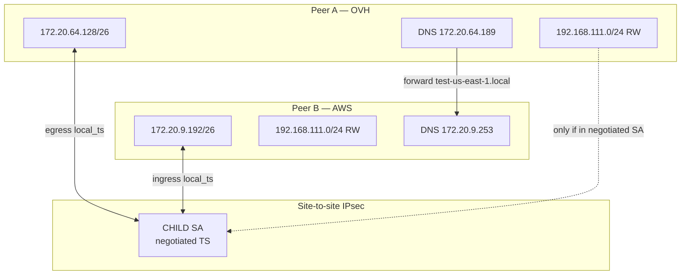

# IPsec VPN Connectivity Design

This document explains **how traffic moves** across a bastion that runs both **road-warrior VPN** (clients connect *to* the bastion) and **VPN gateway** (site-to-site IPsec *between* bastions). It focuses on the `direction` field in peer YAML, traffic selectors (`local_ts` / `remote_ts`), nftables forwarding, and what is actually reachable in each layout.

Operational peer management is in [vpn-gateway-design.md](vpn-gateway-design.md). Road-warrior server setup is in [vpn-design.md](vpn-design.md). Interface tables and nft hook order are in [network-design.md](network-design.md).

---

## Table of Contents

1. [Two independent VPN planes](#two-independent-vpn-planes)
2. [Naming: Peer A and Peer B](#naming-peer-a-and-peer-b)
3. [What `direction` means](#what-direction-means)
4. [Traffic selectors (`local_ts` / `remote_ts`)](#traffic-selectors-local_ts--remote_ts)
5. [IKE negotiation and the effective tunnel](#ike-negotiation-and-the-effective-tunnel)
6. [Direction combinations and reachability](#direction-combinations-and-reachability)
7. [Network flow diagrams](#network-flow-diagrams)
8. [Road-warrior vs site-to-site interaction](#road-warrior-vs-site-to-site-interaction)
9. [Recommended layouts](#recommended-layouts)
10. [Validated test topology (OVH ↔ AWS)](#validated-test-topology-ovh--aws)
11. [Troubleshooting reachability](#troubleshooting-reachability)

---

## Two independent VPN planes

A bastion can run **zero, one, or both** of these at the same time. They use different strongSwan connections and different nftables rules.

| Plane | Config | strongSwan connection | Purpose |
|-------|--------|----------------------|---------|
| **Road-warrior** | `vpn:` in `/etc/mycs/config.yml` | `ikev2-eap-tls` (+ pool `roadwarrior`) | Laptops/phones connect to **this** bastion |
| **VPN gateway** | `vpn_gateway:` + peer YAML under `/data/strongswan/peers/` | `vpn-gateway-<name>` per peer | **This** bastion ↔ **remote** bastion (site-to-site) |



Road-warrior traffic is decrypted on the bastion, then forwarded like any other internal source. VPN gateway traffic is matched by **IPsec policies** derived from each peer's `direction` and CIDR fields before it leaves the DMZ interface.

---

## Naming: Peer A and Peer B

Consider two bastions that peer with each other:

| Term | Meaning |
|------|---------|
| **Peer A** | Bastion at site A (e.g. OVH `test-uk1`) |
| **Peer B** | Bastion at site B (e.g. AWS `test-us-east-1`) |
| **Peer A's YAML** | File on **A** describing how **A** connects to **B** (`host` = B's FQDN) |
| **Peer B's YAML** | File on **B** describing how **B** connects to **A** (`host` = A's FQDN) |

Each bastion has **its own** peer file. Fields are always from **that bastion's perspective**:

| Field | On Peer A's YAML | On Peer B's YAML |
|-------|------------------|------------------|
| `local_cidr` | A's admin subnet (e.g. `172.20.64.128/26`) | B's admin subnet (e.g. `172.20.9.192/26`) |
| `remote_cidr` | B's admin subnet | A's admin subnet |
| `direction` | **A's role** toward B | **B's role** toward A |
| `remote_peer_vpn_subnet` | B's road-warrior pool (for ingress/bidirectional) | A's road-warrior pool |

`direction` is **not** a single global property of the link. It is configured **per side**. The usual production pattern is **A = egress, B = ingress**, but both sides could be `bidirectional` or other combinations (with different consequences below).

---

## What `direction` means

`direction` controls three things on **this** bastion for **this** peer:

| Effect | `egress` | `ingress` | `bidirectional` |
|--------|----------|-----------|-----------------|
| **IKE `start_action`** | `start` — local charon initiates CHILD SA | `none` — wait for remote | `start` — may initiate |
| **Who typically brings the tunnel up first** | This bastion | Remote bastion | Either side |
| **nftables NEW forward** | Local → remote allowed | Remote → local allowed | Both directions |
| **`local_ts` expansion** | `local_cidr` + local `vpn.subnet` if road-warrior enabled | `local_cidr` only | `local_cidr` + local `vpn.subnet` |
| **`remote_ts` expansion** | `remote_cidr` only | `remote_cidr` + `remote_peer_vpn_subnet` (see [shared pool caveat](#shared-road-warrior-pool-vpn_network)) | Same as ingress for remote side |



**Egress** means: “I may start the tunnel and my **local** networks (admin ± road-warrior) may send **new** flows toward the peer's `remote_cidr`.”

**Ingress** means: “I wait for the peer to connect; I accept **new** flows from the peer's networks (admin ± their road-warrior subnet) toward my `local_cidr`.”

**Bidirectional** combines egress initiation and ingress acceptance on the same bastion.

---

## Traffic selectors (`local_ts` / `remote_ts`)

strongSwan CHILD SA **traffic selectors** define which plaintext IP packets are encrypted into the site-to-site tunnel.

| Selector | Plaintext meaning when **sending** outbound through the tunnel | Plaintext meaning when **receiving** inbound from the tunnel |
|----------|----------------------------------------------------------------|---------------------------------------------------------------|
| **`local_ts`** | Source IP must be in `local_ts` | Destination IP must be in `local_ts` |
| **`remote_ts`** | Destination IP must be in `remote_ts` | Source IP must be in `remote_ts` |

Example — Peer **A** egress peer file:

```yaml
local_cidr: 172.20.64.128/26    # A admin
remote_cidr: 172.20.9.192/26     # B admin
direction: egress
```

Rendered on **A** (with road-warrior `192.168.111.0/24`):

```
local_ts  = 172.20.64.128/26, 192.168.111.0/24
remote_ts = 172.20.9.192/26
start_action = start
```

Rendered on **B** ingress peer file:

```yaml
local_cidr: 172.20.9.192/26
remote_cidr: 172.20.64.128/26
remote_peer_vpn_subnet: 192.168.111.0/24
direction: ingress
```

Rendered on **B**:

```
local_ts  = 172.20.9.192/26
remote_ts = 172.20.64.128/26[, 192.168.111.0/24 if not omitted — see below]
start_action = none
```

Scripts: `vpn_gateway_peer_local_ts`, `vpn_gateway_peer_remote_ts`, `vpn_gateway_peer_egress_source_cidrs`, `vpn_gateway_peer_remote_source_cidrs` in `vpn_gateway_common`.

---

## IKE negotiation and the effective tunnel

Each side proposes its own `local_ts` / `remote_ts`. IKEv2 negotiates the **intersection**. The **negotiated** CHILD SA may be **narrower** than either config file.



If **B** omits A's road-warrior subnet from `remote_ts`, the negotiated SA often collapses to **admin ↔ admin only**:

```
172.20.64.128/26 === 172.20.9.192/26
```

That still allows **A admin → B admin** (and return). It may **not** allow **A road-warrior → B admin** even though A's config file lists `192.168.111.0/24` in `local_ts`.

Verify the **negotiated** selectors, not only the config file:

```bash
swanctl --list-sas | grep -E 'local|remote'
```

---

## Direction combinations and reachability

Below: **A** = egress side, **B** = ingress side (recommended). Subnets: `A_admin`, `B_admin`, `A_rw` / `B_rw` = road-warrior pools, `A_lan` / `B_lan` = hosts on admin LANs.

### Admin ↔ admin (baseline)

| Flow | Required layout | Notes |
|------|-----------------|-------|
| A_lan → B_lan | A egress or bidirectional + B ingress or bidirectional | VPC/route: `B_admin` → bastion A; NAT bypass on both |
| B_lan → A_lan | Same | Return path uses established/related nft + IPsec policies |

Works with **egress + ingress** when negotiated SA is admin ↔ admin.

### Road-warrior ↔ remote admin

| Flow | Typically works? | Conditions |
|------|------------------|------------|
| **A_rw → B_lan** | Sometimes | A: `egress`/`bidirectional` (adds `A_rw` to `local_ts`). B: `remote_ts` must include `A_rw` in **negotiated** SA. |
| **B_rw → A_lan** | Usually **no** with B ingress | B ingress does **not** add `B_rw` to `local_ts`. B_rw cannot originate site-to-site flows without B egress/bidirectional. |
| **A_rw → A_lan** (local) | Yes | Road-warrior plane + local forwarding (not gateway) |
| **A_rw → B_rw** | **No** (shared pool) | Same `vpn_network` on both sites → ambiguous addresses |

### Shared road-warrior pool (`vpn_network`)

When **A** and **B** use the same `vpn.subnet` (e.g. `192.168.111.0/24`):

- If `remote_peer_vpn_subnet` equals the **local** pool, it is **omitted from `remote_ts`** on apply (warning logged). This prevents site-to-site from claiming the local pool in `remote_ts`, which would break **local road-warrior DNS** (replies to `192.168.111.x` would be encrypted toward the peer).
- **Trade-off:** negotiated SA is often **admin-only**; cross-site road-warrior reachability is limited even when A lists `A_rw` in `local_ts`.

### Reachability matrix (egress A + ingress B)

| Source | Destination | IPsec / forward |
|--------|-------------|-----------------|
| A_lan | B_lan | Yes |
| B_lan | A_lan | Yes |
| A_rw | B_lan | Negotiated SA dependent |
| B_rw | A_lan | No (B ingress local_ts) |
| A_rw | A_lan | Yes (road-warrior) |
| A_rw | B_rw | No |
| Internet via A | A_rw client | Road-warrior `local_ts 0.0.0.0/0` |

### Direction combination summary

| A direction | B direction | Tunnel initiation | Symmetric admin reachability |
|-------------|-------------|-------------------|------------------------------|
| egress | ingress | A starts | Yes |
| egress | egress | Both try `start` | If SA up |
| ingress | ingress | Neither starts | **No** (no SA) |
| bidirectional | bidirectional | Either | Yes |
| egress | bidirectional | Either | Yes |

---

## Network flow diagrams

### A_lan host → B_lan host (site-to-site)



### A road-warrior → B_lan host



If negotiated SA is admin-only, the packet fails at the **policy match** step even though ping from **A bastion** (source `A_admin`) works.

### A road-warrior → A bastion DNS (local only)



Local `.local` zones must **not** be claimed in site-to-site `remote_ts` on the same pool as local road-warrior clients.

---

## Road-warrior vs site-to-site interaction

| Topic | Road-warrior (`ikev2-eap-tls`) | VPN gateway (`vpn-gateway-*`) |
|-------|-------------------------------|------------------------------|
| Child `local_ts` | `0.0.0.0/0` (full tunnel capable) | `local_cidr` [± `vpn.subnet`] |
| Child `remote_ts` | `0.0.0.0/0` | `remote_cidr` [± `remote_peer_vpn_subnet`] |
| Client pool | `vpn.subnet` (e.g. `192.168.111.0/24`) | N/A |
| nft chain | `mycs_filter` (ipsec in/out) | `inet mycs_vpn_gateway` |
| NAT | Masquerade to DMZ for Internet | **Bypass** for peer CIDRs (no MASQ before IPsec) |

A single client packet may match **only one** IPsec SA. Replies to local road-warrior clients must use the **road-warrior** SA, not site-to-site — hence the `remote_ts` collision guard.

---

## Recommended layouts

### 1. Single initiator (production default)

| Site | `direction` | Role |
|------|-------------|------|
| A (e.g. OVH) | `egress` | Initiates tunnel |
| B (e.g. AWS) | `ingress` | Accepts tunnel |

- Deploy **B (ingress) first**, then **A (egress)** so `remote_ts` / CA trust is ready before initiation.
- Admin ↔ admin connectivity in both directions once SA is up.

### 2. Symmetric admin (both bidirectional)

Both sides `bidirectional`:

- Either side may initiate; watch for duplicate CHILD_SA log lines (usually harmless if SA exists).

### 3. Avoid

| Layout | Problem |
|--------|---------|
| Both `ingress` | No `start_action`; tunnel never comes up |
| Both `egress` without coordination | Duplicate initiate attempts; harder to reason about |
| Same `vpn_network` on both sites + full `remote_peer_vpn_subnet` in `remote_ts` | Breaks local road-warrior DNS |

---

## Validated test topology (OVH ↔ AWS)

| | Peer A (OVH UK1) | Peer B (AWS us-east-1) |
|--|------------------|------------------------|
| DMZ | `172.20.64.125` | `172.20.8.125` |
| Admin / DNS | `172.20.64.189` | `172.20.9.253` |
| `local_cidr` | `172.20.64.128/26` | `172.20.9.192/26` |
| Road-warrior | `192.168.111.0/24` | `192.168.111.0/24` |
| Jumpbox | `jumpbox.test-uk1.local` → `172.20.64.133` | `jumpbox.test-us-east-1.local` → `172.20.9.246` |
| Peer YAML | `aws-us-east-1-peer.yml` `direction: egress` | `ovh-UK1-peer.yml` `direction: ingress` |



**Observed with egress + ingress:**

- `ping` / SSH between jumpboxes using **admin** paths works.

---

## Troubleshooting reachability

| Symptom | Check |
|---------|--------|
| SA up, 0 bytes | NAT bypass: `nft list chain ip mycs_nat postrouting \| grep vpn-gateway` |
| Works from A admin IP, not from A_rw | `swanctl --list-sas` — is `A_rw` in negotiated TS? |
| Road-warrior DNS timeout after bidirectional | `remote_ts` must not include local `vpn.subnet`; re-apply scripts with collision guard |
| `initiate failed: duplicate CHILD_SA` | SA already exists with narrower TS; terminate or accept existing SA |
| Ping "Network unreachable" from bastion | Use `ping -I <admin_ip>`; check admin supernet route on admin NIC |

Full network checklist: [network-design.md](network-design.md#troubleshooting).

---

## Related documentation

- [network-design.md](network-design.md) — nftables, interfaces, boot persistence
- [vpn-gateway-design.md](vpn-gateway-design.md) — peer schema, Terraform export, operational commands
- [vpn-design.md](vpn-design.md) — IKEv2 road-warrior server
- [dns-design.md](dns-design.md) — DNSDist, recursor, local zones
