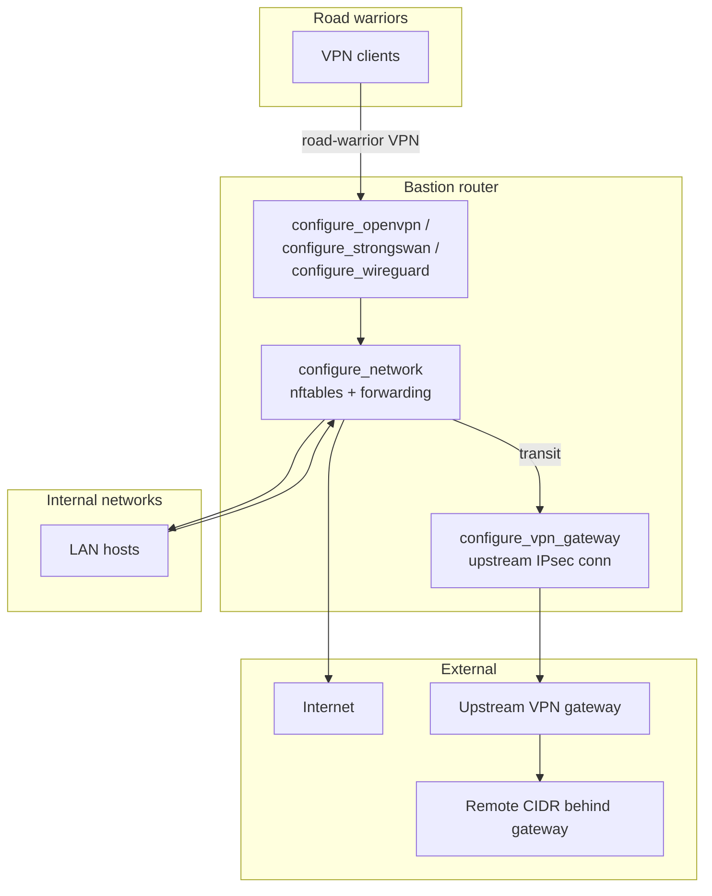
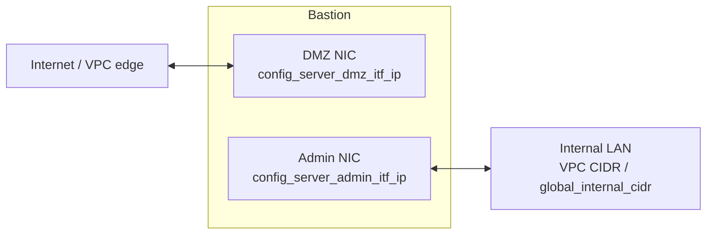
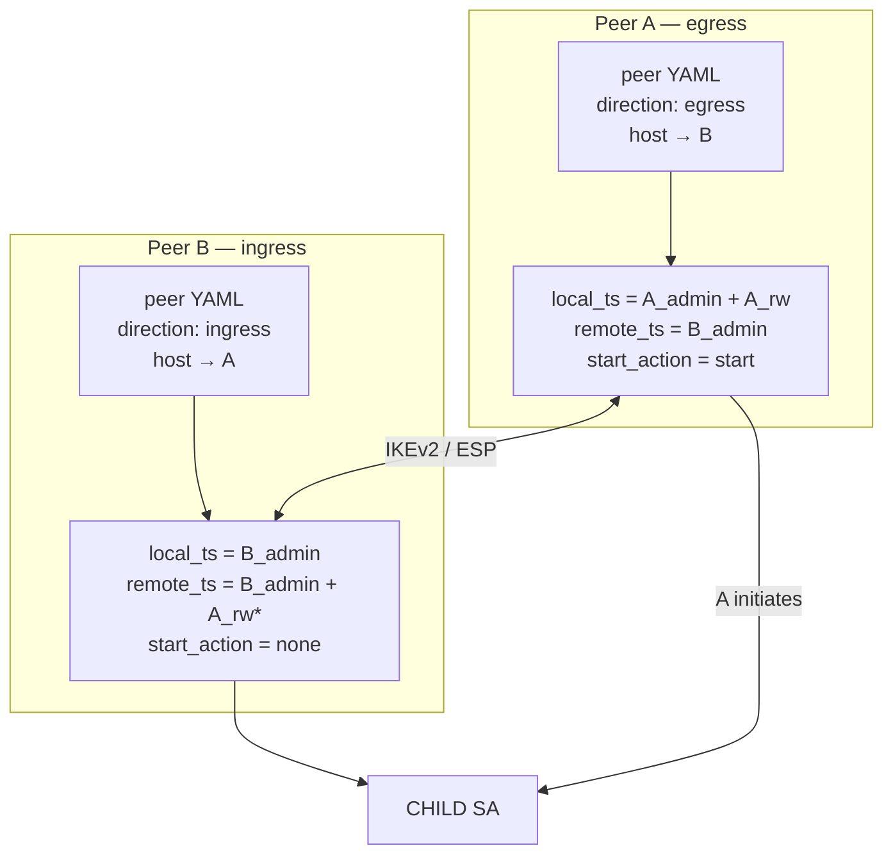
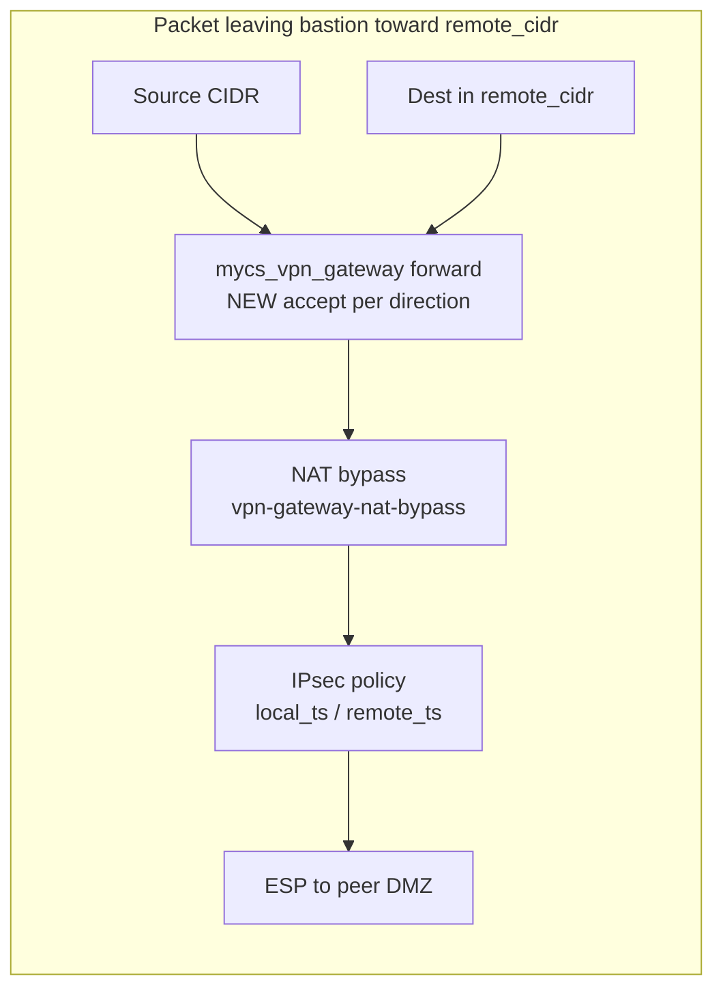
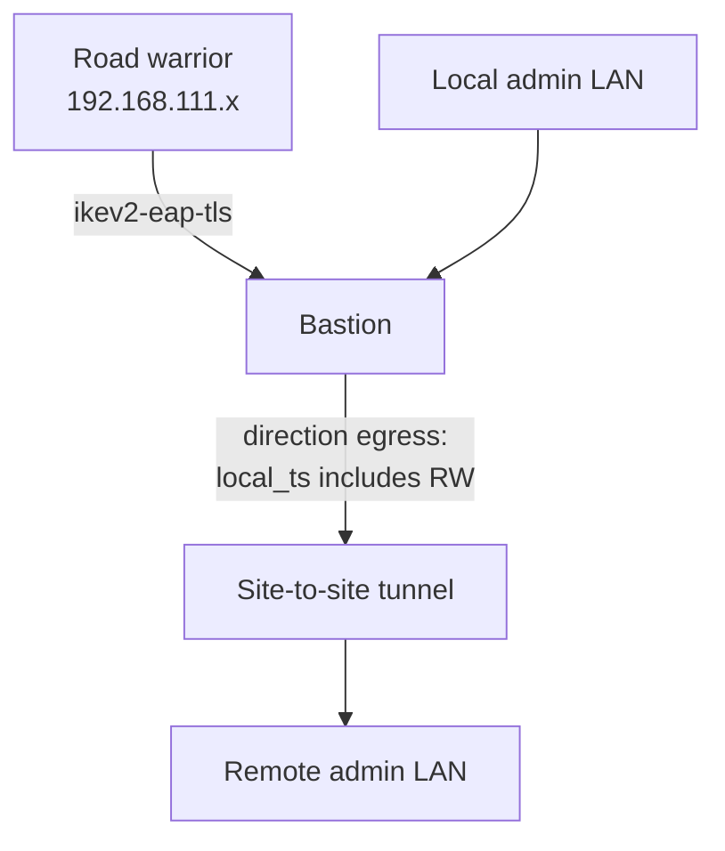
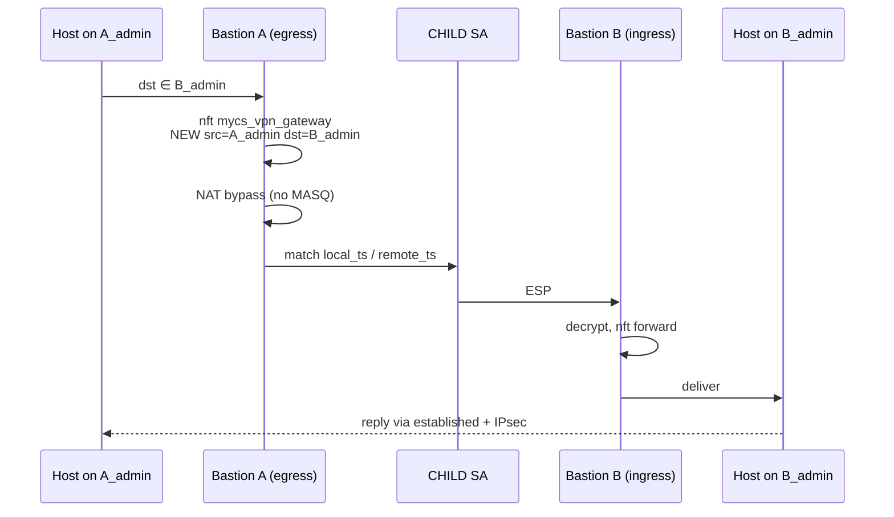
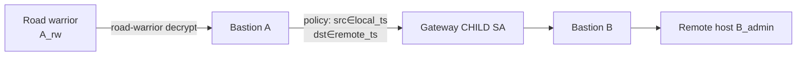

# Bastion Network Design

This document describes how the bastion appliance routes traffic: interface layout, **nftables** packet filtering, road-warrior VPN forwarding, optional **VPN gateway** (site-to-site IPsec), Docker `DOCKER-USER` bypass, and operational troubleshooting.

Runtime configuration is delivered as `/etc/mycs/config.yml` by Terraform (`cloud-inceptor/modules/bastion-config`).

---

## Table of Contents

1. [Overview](#overview)
2. [Configuration Model](#configuration-model)
3. [Bootstrap and Script Responsibilities](#bootstrap-and-script-responsibilities)
4. [Interface Layout](#interface-layout)
5. [Base Router Behaviour](#base-router-behaviour)
6. [Road-Warrior VPN Forwarding](#road-warrior-vpn-forwarding)
7. [VPN Gateway Forwarding](#vpn-gateway-forwarding)
8. [VPN Gateway `direction` and Reachability](#vpn-gateway-direction-and-reachability)
9. [Combined Topologies](#combined-topologies)
10. [nftables Rule Reference](#nftables-rule-reference)
11. [Packet Flow Diagrams](#packet-flow-diagrams)
12. [Persistence and Boot](#persistence-and-boot)
13. [Docker DOCKER-USER Forward Bypass](#docker-docker-user-forward-bypass)
14. [Terraform Integration](#terraform-integration)
15. [Troubleshooting](#troubleshooting)
16. [Operational Notes](#operational-notes)

---

## Overview

The bastion is a **Linux router** with one or more Ethernet interfaces:

| Role | Typical interface | Purpose |
|------|-------------------|---------|
| DMZ / NAT | First NIC (`eth0`, `ens3`, `ens5`, …) | Public or edge-facing; default route to the Internet |
| Admin / internal LAN | Second NIC (optional) | VPC or private network segments |

At first boot, `configure_network` applies netplan, enables IP forwarding, and installs **LAN** nftables forwarding and NAT rules. Road-warrior and VPN-gateway rules are added by each `configure_*` VPN script after its service is configured.

Road-warrior VPN and VPN gateway are **orthogonal**:

- **`vpn`** — how remote users connect *to* the bastion (exactly one of wireguard, openvpn, or ipsec).
- **`vpn_gateway`** — how the bastion connects *out* to upstream IPsec peers (site-to-site).

Either section may be omitted from `config.yml`.



For road-warrior VPN configuration details see [vpn-design.md](vpn-design.md). For site-to-site gateway peers see [vpn-gateway-design.md](vpn-gateway-design.md). For **how `direction` affects connectivity, traffic selectors, and reachability between two bastions**, see [ipsec-vpn-connectivity-design.md](ipsec-vpn-connectivity-design.md).

---

## Configuration Model

YAML is parsed by `scripts/config/common` (`parse_yaml`) into bash variables prefixed with `config_`. Nested keys use underscores (e.g. `vpn_gateway.protocol` → `config_vpn_gateway_protocol`).

### Optional defaults

| Variable | Default |
|----------|---------|
| `config_vpn_type` | *(empty — no road-warrior VPN)* |
| `config_vpn_subnet` | *(empty)* |
| `config_vpn_gateway_enabled` | `no` |
| `config_vpn_gateway_protocol` | `ipsec` |

### `server.lan_interfaces`

Comma-separated NIC descriptors. Each entry uses pipe-separated fields:

```
private_ip|interface_cidr|static_route_cidr|gateway|dhcp_start|dhcp_end
```

| Field | Meaning |
|-------|---------|
| `private_ip` | Static IP, DHCP (`""`), or disable (`x`) |
| `interface_cidr` | Subnet on this link (e.g. `172.20.64.128/26`) |
| `static_route_cidr` | Route installed on this interface (often `0.0.0.0/0` on DMZ) |
| `gateway` | Next hop for static route |
| `dhcp_*` | Optional DHCP range served by bastion |

The **first** entry is always the DMZ/NAT interface.

When `bastion_as_nat` is enabled in Terraform, the admin NIC static route for `global_internal_cidr` (e.g. `172.16.0.0/12`) is **cleared** in netplan to prevent a cloud-provisioned supernet route from stealing traffic destined for VPN peer CIDRs. At runtime, `vpn_gateway_remove_admin_supernet_routes` in `vpn_gateway_common` deletes any remaining conflicting static routes on the admin interface.

### `vpn_gateway` (global defaults)

`vpn_gateway` in `/etc/mycs/config.yml` supplies **global** strongSwan defaults. Individual peers are defined in `/data/strongswan/peers/<name>.yaml` and managed with `manage_vpn_gateway_peer`.

| Key | Purpose |
|-----|---------|
| `enabled` | `yes` runs `configure_vpn_gateway` bootstrap |
| `protocol` | `ipsec` (only supported value today) |
| `local_id` | Local IKE identity (typically bastion FQDN) |

---

## Bootstrap and Script Responsibilities

| Script | Responsibility |
|--------|----------------|
| `configure_network` | netplan, sysctl, **LAN nftables** (no VPN rules) |
| `configure_openvpn` / `configure_strongswan` / `configure_wireguard` | Protocol setup + **road-warrior nft rules** |
| `configure_vpn_gateway` | Gateway bootstrap; peer swanctl + **VPN gateway nft rules** |
| `manage_vpn_gateway_peer` | Runtime peer add/remove/list/apply |

Shared routing helpers live in **`common`** (`network_*` functions).

`init_instance` order:

```
mount_volume
configure_network        ← netplan, sysctl, LAN nftables
configure_users / apache / docker
configure_powerdns
configure_smtp / openvpn / strongswan / wireguard / vpn_gateway / ...
```

When `init_instance` exits, it writes `/var/log/network-configuration.dump` via `network_configuration_dump` in `network_dump`.

---

## Interface Layout



- **DMZ**: VPN listeners bind here; NAT to the Internet uses this interface as `-o $public_itf`.
- **Admin/LAN**: Internal workloads; IKE often uses DMZ public IP with NAT-T.

Static interfaces set `dhcp4: false` and `dhcp6: false` so cloud-init's ephemeral DHCP does not compete with systemd-networkd on secondary ENIs. When a `static_route_cidr` is configured, the address uses the interface subnet prefix (e.g. `/26`) rather than `/32` so connected routes apply reliably at boot.

---

## Base Router Behaviour

Applied by `configure_network`. VPN-specific nftables are added later by each `configure_*` VPN script.

### sysctl

- `net.ipv4.ip_forward=1`
- ICMP redirects disabled; `rp_filter=2` (loose)

### nftables tables

Created by `network_nft_init` in `common`:

| Table | Family | Chain | Hook |
|-------|--------|-------|------|
| `mycs_filter` | `inet` | `input` | input (filter) |
| `mycs_filter` | `inet` | `forward` | forward (filter) |
| `mycs_nat` | `ip` | `postrouting` | postrouting (srcnat) |
| `mycs_mangle` | `ip` | `forward` | forward (mangle) |

Base rules:

1. **input**: `ct state established,related accept`; `iif lo accept`; `ct state invalid drop`
2. **forward**: `ct state established,related accept` (inserted at chain head)
3. **Per LAN subnet**: `masquerade` on DMZ; forward NEW to Internet and peer LANs

Example LAN masquerade:

```nft
insert rule ip mycs_nat postrouting oifname "ens3" ip saddr 172.20.64.128/26 masquerade
insert rule inet mycs_filter forward iifname "ens4" oifname "ens3" ip saddr 172.20.64.128/26 ct state new accept
```

---

## Road-Warrior VPN Forwarding

Configured when `vpn.type` and `vpn.subnet` are set. Routing is applied in `network_apply_roadwarrior_routing()` from the active VPN `configure_*` script via `network_apply_roadwarrior_vpn_nft`.

### Ingress (`network_apply_vpn_ingress_rules`)

| Type | INPUT rule |
|------|------------|
| OpenVPN | `iifname $dmz $protocol dport $port accept` |
| WireGuard | `iifname $dmz udp dport $port accept` |
| IPsec | `udp dport { 500, 4500 } accept` |

### Egress and forwarding

| Type | Match | Internet | Internal LAN |
|------|-------|----------|--------------|
| OpenVPN | `iifname "tun0"` | forward to DMZ + `masquerade` | forward `tun0` → LAN |
| WireGuard | `iifname "wg0"` | forward to DMZ + `masquerade` | forward `wg0` → LAN |
| IPsec | `ipsec in/out ip saddr/daddr` | `masquerade` + IPsec policy rules | forward DMZ → LAN |

IPsec MSS clamp (`mycs_mangle`):

```nft
add rule ip mycs_mangle forward ipsec in ip saddr $vpn_subnet oifname $dmz \
  tcp flags syn,rst tcp option maxseg size 1361-1536 tcp option maxseg size set 1360
```

See [vpn-design.md](vpn-design.md) for server configuration.

---

## VPN Gateway Forwarding

When `vpn_gateway.enabled: yes` or peer YAML exists under `/data/strongswan/peers/`, forward policy is managed in table `inet mycs_vpn_gateway` (`/data/network/etc/vpn-gateway-peers.nft`).

Peer forward rules are generated by `vpn_gateway_regenerate_nft` in `vpn_gateway_common`. NAT bypass rules in `ip mycs_nat postrouting` prevent masquerade from breaking IPsec traffic selectors.

For egress/bidirectional peers, road-warrior subnet (`config_vpn_subnet`) is included in NAT bypass and forward rules alongside `local_cidr`.

See [vpn-gateway-design.md](vpn-gateway-design.md) for peer schema, Terraform export, and operational commands. See [ipsec-vpn-connectivity-design.md](ipsec-vpn-connectivity-design.md) for **direction semantics, reachability matrices, and flow diagrams**.

---

## VPN Gateway `direction` and Reachability

This section summarises how the **`direction`** field in each bastion's peer YAML affects **who initiates the tunnel**, **which CIDRs are carried in IPsec traffic selectors**, and **what hosts can reach what** across a site-to-site link. The full treatment (Peer A / Peer B terminology, IKE intersection, DNS asymmetry, shared `vpn_network` caveats) is in [ipsec-vpn-connectivity-design.md](ipsec-vpn-connectivity-design.md).

### Peer A and Peer B

Each bastion stores **its own** peer file describing the **remote** site:

| On bastion | YAML describes | `local_cidr` | `remote_cidr` | `direction` means |
|------------|----------------|--------------|---------------|-------------------|
| **Peer A** | Remote = B | A's admin LAN | B's admin LAN | **A's role** toward B |
| **Peer B** | Remote = A | B's admin LAN | A's admin LAN | **B's role** toward A |

`direction` is **per bastion**, not a single property of the link. A common pattern is **A = egress**, **B = ingress**, but other combinations are valid with different reachability (see below).

### What each `direction` changes on this bastion

| | `egress` | `ingress` | `bidirectional` |
|---|----------|-----------|-----------------|
| **IKE `start_action`** | `start` (initiate CHILD SA) | `none` (wait for peer) | `start` |
| **`local_ts` (outbound src)** | `local_cidr` + local `vpn.subnet` if road-warrior | `local_cidr` only | `local_cidr` + `vpn.subnet` |
| **`remote_ts` (outbound dst)** | `remote_cidr` | `remote_cidr` + `remote_peer_vpn_subnet`* | same as ingress for remote |
| **nftables NEW forward** | Local → remote | Remote → local | Both |

\*If `remote_peer_vpn_subnet` equals **this** bastion's own `vpn.subnet`, it is **omitted** from `remote_ts` so local road-warrior DNS replies are not sent into the site-to-site tunnel. See [ipsec-vpn-connectivity-design.md](ipsec-vpn-connectivity-design.md#shared-road-warrior-pool-vpn_network).

### Traffic selectors (quick reference)

strongSwan CHILD SA selectors gate which plaintext packets enter the **site-to-site** tunnel (separate from road-warrior `ikev2-eap-tls`):

| Selector | Outbound encrypted packet | Inbound decrypted packet |
|----------|---------------------------|--------------------------|
| **`local_ts`** | Source ∈ `local_ts` | Destination ∈ `local_ts` |
| **`remote_ts`** | Destination ∈ `remote_ts` | Source ∈ `remote_ts` |

IKE negotiates the **intersection** of both sides' proposals. Always verify **negotiated** selectors:

```bash
swanctl --list-sas | grep -E 'local|remote'
```

Config files may list road-warrior CIDRs in `local_ts` while the live SA is **admin-only** — road-warrior → remote-LAN may then fail even when bastion → remote-LAN works.

### Recommended layout: egress (A) + ingress (B)



**Deploy order:** apply **B (ingress)** first, then **A (egress)** so trust material and `remote_ts` are ready before initiation.

### Reachability matrix (egress A + ingress B)

Assume negotiated SA is **admin ↔ admin** (typical when both sites share `vpn_network` and `remote_peer_vpn_subnet` is omitted on B).

| Source | Destination | Reachable? | Mechanism |
|--------|-------------|------------|-----------|
| A admin host | B admin host | **Yes** | Site-to-site; `local_ts` / `remote_ts` |
| B admin host | A admin host | **Yes** | Return / established |
| A road-warrior client | B admin host | **Often no** | Needs `A_rw` in **negotiated** SA |
| B road-warrior client | A admin host | **No** | B ingress does not add `B_rw` to `local_ts` |
| A road-warrior client | A admin / DNS | **Yes** | Road-warrior SA + local forward |
| A road-warrior client | B road-warrior client | **No** | Ambiguous if same `vpn_network` |

For **symmetric road-warrior → remote admin** with distinct pools per site, see the full matrix in [ipsec-vpn-connectivity-design.md](ipsec-vpn-connectivity-design.md#direction-combinations-and-reachability).

### How `direction` maps to nftables and NAT



- **Egress / bidirectional:** `vpn_gateway_regenerate_nft` allows **NEW** `src ∈ local_cidr [± vpn.subnet]` → `dst ∈ remote_cidr`.
- **Ingress / bidirectional:** allows **NEW** `src ∈ remote_cidr [± remote_peer_vpn_subnet]` → `dst ∈ local_cidr`.
- **NAT bypass** (`vpn_gateway_refresh_nat_bypass`) must run **before** DMZ masquerade or IPsec selectors never see original sources.

### Two VPN planes on one bastion

Road-warrior and VPN gateway are **orthogonal** strongSwan connections:

| Connection | Clients / peers | Typical selectors |
|------------|-----------------|-------------------|
| `ikev2-eap-tls` | Road warriors | `local_ts = 0.0.0.0/0`, pool `vpn.subnet` |
| `vpn-gateway-<name>` | Remote bastion | `local_cidr` / `remote_cidr` per `direction` |

A road-warrior client reaches a remote LAN by: **decrypt on road-warrior SA** → **forward on bastion** → **encrypt on gateway SA** (only if gateway policy matches). Replies to the client must use the **road-warrior** SA, not the gateway — hence the `remote_ts` collision guard for shared `vpn_network`.

---

## Combined Topologies

### A — Router only

No `vpn` or `vpn_gateway` sections. Base LAN ↔ Internet forwarding only.

### B — Road-warrior only

```yaml
vpn:
  type: ipsec   # or openvpn / wireguard
  subnet: 192.168.111.0/24
```

Road warriors reach local admin LAN and Internet per `vpn.tunnel_client_traffic`. No site-to-site tunnel.

### C — VPN gateway only

```yaml
vpn_gateway:
  enabled: yes
  protocol: ipsec
```

Peers added at runtime with `manage_vpn_gateway_peer add`. Admin hosts on each side reach the peer `remote_cidr` when routes and `direction` are correct. No remote VPN clients.

### D — Road-warrior + VPN gateway (typical multi-site)

Both sections present. Road warriors and LAN hosts on the **egress** side can reach the peer admin LAN when traffic selectors and nft rules align.



Example pairing:

| Site | `vpn` | Gateway peer `direction` | Can initiate tunnel? |
|------|-------|---------------------------|----------------------|
| OVH | ipsec `192.168.111.0/24` | `egress` | Yes |
| AWS | ipsec `192.168.111.0/24` | `ingress` | No (accepts) |

Detailed flows: [ipsec-vpn-connectivity-design.md](ipsec-vpn-connectivity-design.md#validated-test-topology-ovh--aws).

---

## nftables Rule Reference

Rule generation order:

```
1. network_nft_init (configure_network)
2. LAN loop in configure_network — masquerade + inter-LAN forward
3. network_nft_save (configure_network)
4. network_apply_roadwarrior_vpn_nft (configure_openvpn / strongswan / wireguard)
5. vpn_gateway_regenerate_nft (configure_vpn_gateway / manage_vpn_gateway_peer)
6. network_nft_save after each VPN script
```

`rc.local` loads `/data/network/etc/nftables.conf` on every boot with `nft -f`.

VPN gateway NAT bypass uses comment `vpn-gateway-nat-bypass` and is inserted at **position 0** in `ip mycs_nat postrouting` so it precedes LAN masquerade rules.

---

## Packet Flow Diagrams

### LAN host → remote admin LAN (site-to-site, egress initiator)

Applies when **local** peer YAML has `direction: egress` or `bidirectional` and cloud routes send `remote_cidr` to this bastion.



### Road-warrior → remote admin LAN (combined topology D)

Requires **egress** (or bidirectional) on the road-warrior's bastion **and** matching **negotiated** traffic selectors on both sides.



If `swanctl --list-sas` shows only `A_admin === B_admin`, treat road-warrior → remote-LAN as **unsupported** until selectors include `A_rw` (may require distinct `vpn_network` per site).

### Return path and policy routing

strongSwan installs routes in **table 220**. The bastion ensures `ip rule pref 220 lookup 220`. Replies to remote subnets must follow IPsec policies installed for the CHILD SA. Admin supernet routes on the admin NIC must not steal peer CIDRs — see [vpn-gateway-design.md](vpn-gateway-design.md#admin-supernet-route-removal).

---

## Persistence and Boot

| Path | Purpose |
|------|---------|
| `/data/network/etc/nftables.conf` | Saved `mycs_filter`, `mycs_nat`, `mycs_mangle` tables |
| `/etc/netplan/99-bastion-network-config.yaml` | Interface configuration |
| `/data/network/etc/vpn-gateway-peers.nft` | VPN gateway forward table (loaded by systemd) |

On every boot:

- `rc.local` → `nft -f /data/network/etc/nftables.conf`
- `cloud-inceptor-vpn-gateway-peers.service` → reload gateway nft, NAT bypass, policy routing, remove admin supernet routes

Stock `nftables.service` is disabled at image build time.

---

## Docker DOCKER-USER Forward Bypass

Docker installs an `ip filter FORWARD` chain with **policy DROP** and an empty **`DOCKER-USER`** chain when `dockerd` starts. Bastion VPN rules live in **`inet mycs_filter`** (policy accept). After reboot, Docker may register before `rc.local` reloads nftables, dropping forwarded VPN traffic unless `DOCKER-USER` allows it.

`configure_docker` installs:

| Component | Purpose |
|-----------|---------|
| `apply_docker_user_forward` | Idempotently inserts `ACCEPT` in `DOCKER-USER` per forward CIDR |
| `docker.service.d/cloud-inceptor-forward.conf` | `ExecStartPost` re-applies rules on every `dockerd` start |
| `cloud-inceptor-docker-forward.service` | Oneshot applies rules after Docker on boot |

CIDRs from `network_collect_docker_user_forward_cidrs`: road-warrior subnet, LAN prefixes, VPN gateway transit sources.

---

## Terraform Integration

`cloud-inceptor/modules/bastion-config/bastion.tf` emits `vpn_gateway:` with:

| Terraform variable | YAML key |
|--------------------|----------|
| `vpn_gateway_enabled` | `vpn_gateway.enabled` |
| `vpn_gateway_protocol` | `vpn_gateway.protocol` |
| *(derived)* | `vpn_gateway.local_id` ← bastion FQDN |

Peer-specific settings (remote host, CIDRs, CA PEMs) are **not** in Terraform; they are managed via peer YAML at runtime.

Bootstrap modules pass `vpn_gateway_peer_cidrs` for security group rules allowing ingress from remote peer admin CIDRs.

For LAN reachability to `remote_cidr`, add VPC routes pointing at the bastion instance.

---

## Troubleshooting

### Health check script (run as root)

Use this consolidated check on either bastion when diagnosing site-to-site connectivity:

```bash
echo "=== $(hostname) $(date -u) ==="

echo "--- strongswan ---"
systemctl is-active strongswan
ls -la /var/run/charon.vici

echo "--- peers ---"
manage_vpn_gateway_peer list
grep -E 'local_ts|remote_ts' /data/strongswan/etc/conf.d/peer-*.conf

echo "--- swanctl ---"
swanctl --list-conns | grep -E 'vpn-gateway|net:'
swanctl --list-sas

echo "--- routing ---"
ip route | grep -E '172\.(16|20)|default'
ip rule list
ip route show table 220 2>/dev/null

echo "--- nft NAT bypass ---"
nft -a list chain ip mycs_nat postrouting | grep -E 'vpn-gateway|172\.|192\.168' | head -15
nft list table inet mycs_vpn_gateway 2>/dev/null | head -30

echo "--- reachability ---"
ping -c1 -W2 <local_dmz_ip> >/dev/null && echo "DMZ ok" || echo "DMZ fail"
ping -I <admin_ip> -c2 -W2 <remote_jumpbox_ip>

echo "--- charon log ---"
journalctl -u strongswan -n 40 --no-pager
```

Run `swanctl` as **root** — non-root users get `Permission denied` on `/var/run/charon.vici`.

### Ping fails with "Destination Host Unreachable" to remote LAN

**Symptom:** Tunnel appears configured but ping from bastion admin subnet to remote jumpbox fails; `swanctl --list-sas` may show 0 bytes/packets.

**Causes and fixes validated in OVH ↔ AWS testing:**

1. **Wrong source IP** — Ping from DMZ IP when traffic selectors only include admin subnet.
   ```bash
   # Use admin interface IP explicitly
   ping -I 172.20.64.189 -c2 172.20.9.249
   ```

2. **Conflicting admin supernet route** — OpenStack/AWS may install `172.16.0.0/12 via <admin-gateway> dev <admin-nic>`, intercepting traffic to remote peer CIDRs.
   ```bash
   ip route show dev ens4   # admin NIC
   # Fix: Terraform clears static route when bastion_as_nat=true
   # Runtime: manage_vpn_gateway_peer apply runs vpn_gateway_remove_admin_supernet_routes
   ```

3. **NAT masquerade before VPN bypass** — Traffic masqueraded before IPsec policy match.
   ```bash
   nft -a list chain ip mycs_nat postrouting | head -20
   # vpn-gateway-nat-bypass rules must appear BEFORE masquerade rules
   sudo manage_vpn_gateway_peer apply
   ```

4. **Policy routing not active**
   ```bash
   ip rule list | grep 220
   # Should show: 220: from all lookup 220
   ```

### swanctl --list-sas empty after apply

**Symptom:** No IKE/CHILD SAs after `manage_vpn_gateway_peer apply`.

**Causes:**

- Egress peer not initiated (AWS ingress waits; OVH egress must initiate).
- `swanctl --initiate` failed silently (now logs WARNING).

**Fix:**

```bash
# On egress side (e.g. OVH)
swanctl --initiate --child aws-us-east-1-net --ike vpn-gateway-aws-us-east-1
swanctl --list-sas

# Or re-apply (auto-initiates egress/bidirectional peers)
sudo manage_vpn_gateway_peer apply
```

### Road-warrior clients cannot reach remote peer LAN

**Symptom:** Bastion admin subnet ping works; VPN clients cannot.

**Causes:**

1. **Negotiated SA is admin-only** — `swanctl --list-sas` does not include `vpn.subnet` even though egress config file lists it.
2. **Ingress side missing `remote_peer_vpn_subnet`** — or omitted due to **shared `vpn_network`** with local pool (see [ipsec-vpn-connectivity-design.md](ipsec-vpn-connectivity-design.md#shared-road-warrior-pool-vpn_network)).
3. **Ingress bastion** — road warriors on B cannot originate site-to-site flows (`local_ts` on B does not include `B_rw` when B is ingress-only).

**Fix:** Verify negotiated TS; consider `bidirectional` on ingress side for DNS; use distinct `vpn_network` per site if road-warrior → remote-LAN is required.

### Docker blocking forwarded traffic after reboot

```bash
iptables -S DOCKER-USER
sudo /usr/local/lib/cloud-inceptor/apply_docker_user_forward
```

### Full network dump

```bash
sudo /usr/local/lib/cloud-inceptor/network_dump /tmp/netdump.txt success
less /tmp/netdump.txt
cat /var/log/network-configuration.dump
```

### Init / configure_network logs

```bash
sudo tail -100 /var/log/configure_network.log
sudo nft list ruleset | less
ip -4 addr; ip route; ip rule list
```

---

## Operational Notes

1. **Overlapping CIDRs** — Avoid overlap between `vpn.subnet`, LAN subnets, and peer `remote_cidr`.
2. **strongSwan unit** — Ubuntu 24.04+ uses `strongswan.service` with `swanctl`; legacy `ipsec.conf` is not used.
3. **Re-running scripts** — Marker files under `/usr/local/etc/.{service}_installed` prevent duplicate configuration.
4. **nftables only** — Tables `mycs_filter`, `mycs_nat`, `mycs_mangle`; IPsec rules require kernel xfrm/`ipsec` expression support.
5. **Agent plugin warnings** — `agent plugin requires CAP_SETUID` from `swanctl` as non-root is harmless; always run diagnostics as root.

---

## Related Documentation

- [ipsec-vpn-connectivity-design.md](ipsec-vpn-connectivity-design.md) — **Peer A/B, `direction`, reachability matrices, IPsec + road-warrior flows**
- [vpn-design.md](vpn-design.md) — Road-warrior VPN (OpenVPN, WireGuard, IKEv2)
- [vpn-gateway-design.md](vpn-gateway-design.md) — Site-to-site peers, Terraform export, operations
- [dns-design.md](dns-design.md) — Internal DNS (DNSDist, recursor, local zones)
- [runtime-bootstrap-design.md](runtime-bootstrap-design.md) — First-boot orchestration
