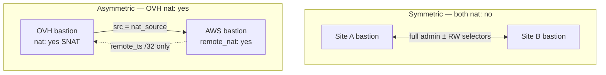
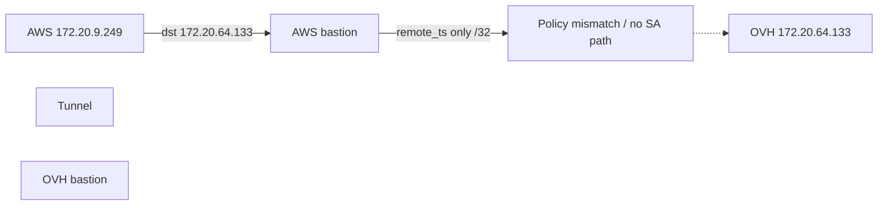

# Bastion VPN Gateway Design (Site-to-Site IPsec)

Site-to-site IPsec between bastions using StrongSwan swanctl, per-peer YAML, nftables forwarding, and optional **peer NAT** for asymmetric reachability.

Road-warrior VPN: [vpn-design.md](vpn-design.md). Network context: [network-design.md](network-design.md). Additional flow variants: [ipsec-vpn-connectivity-design.md](ipsec-vpn-connectivity-design.md).

---

## Table of Contents

1. [Overview](#overview)
2. [Architecture](#architecture)
3. [Peer YAML Schema](#peer-yaml-schema)
4. [Symmetric peering (default)](#symmetric-peering-default)
5. [Asymmetric NAT peering (OVH ↔ AWS)](#asymmetric-nat-peering-ovh--aws)
6. [Traffic selectors](#traffic-selectors)
7. [nftables, SNAT, and NAT bypass](#nftables-snat-and-nat-bypass)
8. [Runtime management](#runtime-management)
9. [Terraform peer export](#terraform-peer-export)
10. [Troubleshooting](#troubleshooting)

---

## Overview

Peers live under `/data/strongswan/peers/` and are managed with `manage_vpn_gateway_peer` (no image rebuild).

**Default:** symmetric peering — both bastions use full admin (± road-warrior) traffic selectors and may initiate the tunnel.

**Optional NAT:** when `vpn_gateway.nat: yes` in config.yml (Terraform `vpn_gateway_nat`), this bastion **SNATs** outbound peer traffic to `nat_source`. Per-peer `nat:` in YAML overrides the global default. The remote site should set **`remote_nat: yes`** so its `remote_ts` is only the gateway `/32`.

---

## Architecture



Both sides use `start_action = start` and call `swanctl --initiate` on apply (duplicate CHILD_SA log lines are harmless).

---

## Peer YAML Schema

Required: `name`, `host`, `remote_cidr`, `auth`. `local_cidr` defaults from `vpn_gateway.local_cidr` in `/etc/mycs/config.yml`.

| Field | Default | Description |
|-------|---------|-------------|
| `nat` | `vpn_gateway.nat` in config.yml | **On this bastion:** SNAT outbound traffic to this peer to `nat_source` |
| `nat_source` | `server.admin_itf_ip` | Inner source IP seen by remote (admin gateway IP) |
| `remote_nat` | `no` | **Remote peer** uses NAT peering |
| `remote_nat_source` | — | Required when `remote_nat: yes`; remote gateway IP (`/32` in `remote_ts`) |
| `remote_peer_vpn_subnet` | — | Remote road-warrior pool (symmetric cross-site RW only) |
| `remote_cidr` | — | Remote admin subnet (routing/docs; may differ from effective `remote_ts`) |
| *(fixed)* IKE version | **2** | Always IKEv2 (`version = 2` in swanctl). No peer YAML or config.yml field; IKEv1 is not supported. |
| `ike_encryption` | `aes256` | Phase 1 encryption algorithm |
| `ike_integrity` | `sha256` | Phase 1 integrity / PRF |
| `ike_dh_group` | `14` | Phase 1 Diffie-Hellman group (`14` = modp2048) |
| `ike_lifetime` | `86400` | IKE rekey interval (seconds) |
| `nat_t` | `yes` | NAT-T / UDP encapsulation (`encap` in swanctl) |
| `ipsec_encryption` | `aes256` | Phase 2 encryption algorithm |
| `ipsec_integrity` | `sha256` | Phase 2 integrity algorithm |
| *(fixed)* PFS | **yes** | Enabled by default: ESP proposal includes `ipsec_dh_group` (default `modp2048`). No `pfs:` YAML field. To disable PFS use `esp_proposals: aes256-sha256` (no DH suffix). |
| `ipsec_dh_group` | `14` | Phase 2 DH group (`14` = modp2048); included in ESP proposal and enables PFS |
| `ipsec_lifetime` | `43200` | CHILD SA lifetime (seconds) |
| `ike_proposals` | — | Optional raw IKE proposal string (overrides `ike_*` fields) |
| `esp_proposals` | — | Optional raw ESP proposal string (overrides `ipsec_*` fields; omit DH suffix to disable PFS) |

**Fixed defaults (not overridable via peer YAML):** IKE version **2**. **PFS yes** via default `ipsec_dh_group: 14` → ESP proposal `aes256-sha256-modp2048`.

Global `vpn_gateway` in config.yml: `enabled`, `protocol`, `local_id`, `local_cidr`, `nat` (default SNAT for all peers unless overridden in peer YAML), plus global crypto defaults (`ike_encryption`, `ike_integrity`, `ike_dh_group`, `ike_lifetime`, `ipsec_encryption`, `ipsec_integrity`, `ipsec_dh_group`, `ipsec_lifetime`, `nat_t`).

```yaml
vpn_gateway:
  enabled: yes
  protocol: ipsec
  local_id: test-uk1.ovh.appbricks.io
  local_cidr: 172.20.64.128/26
  nat: yes    # Terraform: vpn_gateway_nat; OVH test bastion
```

Set `vpn_gateway_nat = true` in bootstrap Terraform on bastions that SNAT toward peers (e.g. OVH). Independent of `bastion_as_nat`.

Example peer matching a typical HSCN / enterprise Phase 1+2 policy (all values shown are defaults):

```yaml
name: remote-gateway
host: gateway.example.com
remote_id: gateway.example.com
remote_cidr: 172.20.9.192/26
auth: cert
remote_ca: remote-ca.pem
remote_ca_pem: |
  -----BEGIN CERTIFICATE-----
  ...
ike_encryption: aes256
ike_integrity: sha256
ike_dh_group: 14
ike_lifetime: 86400
nat_t: yes
# IKE version: 2 (fixed — not a YAML field)
ipsec_encryption: aes256
ipsec_integrity: sha256
ipsec_dh_group: 14      # default enables PFS (no separate pfs: field)
ipsec_lifetime: 43200
# Default ESP proposal: aes256-sha256-modp2048 (PFS on)
```

---

## Symmetric peering (default)

Two sites **A** and **B**, both `nat: no`, `remote_nat: no`.

### Sample configs

**Site A** — `/data/strongswan/peers/site-b.yaml`:

```yaml
name: site-b
host: bastion-b.example.com
remote_id: bastion-b.example.com
remote_cidr: 10.20.0.0/24
remote_peer_vpn_subnet: 192.168.111.0/24   # if B has road-warrior VPN
auth: cert
remote_ca: site-b-ca.pem
remote_ca_pem: |
  -----BEGIN CERTIFICATE-----
  ...
```

**Site B** — `/data/strongswan/peers/site-a.yaml`:

```yaml
name: site-a
host: bastion-a.example.com
remote_id: bastion-a.example.com
remote_cidr: 10.10.0.0/24
remote_peer_vpn_subnet: 192.168.112.0/24   # if A has road-warrior VPN
auth: cert
remote_ca: site-a-ca.pem
remote_ca_pem: |
  -----BEGIN CERTIFICATE-----
  ...
```

### Traffic selectors (symmetric)

| Bastion | `local_ts` | `remote_ts` |
|---------|------------|-------------|
| A | `10.10.0.0/24` + A `vpn.subnet` | `10.20.0.0/24` + B RW pool* |
| B | `10.20.0.0/24` + B `vpn.subnet` | `10.10.0.0/24` + A RW pool* |

\*Omitted from `remote_ts` when equal to **local** RW pool (shared-pool guard).

### Flow — A admin host → B admin host

```mermaid
sequenceDiagram
  participant H as Host 10.10.0.5
  participant A as Bastion A
  participant T as IPsec SA
  participant B as Bastion B
  participant J as Host 10.20.0.10

  H->>A: dst 10.20.0.10
  A->>A: nft NEW forward; NAT bypass
  A->>T: encrypt (local_ts → remote_ts)
  T->>B: ESP
  B->>J: forward
  J-->>H: reply
```

### Flow — B admin host → A admin host

Same path in reverse; both sides may initiate the SA. Admin ↔ admin is **symmetric**.

### Reachability (symmetric)

| Source | Destination | Works? |
|--------|-------------|--------|
| A admin | B admin | Yes |
| B admin | A admin | Yes |
| A road-warrior | B admin | Yes* |
| B road-warrior | A admin | Yes* |

\*When `remote_peer_vpn_subnet` is set and negotiated SA includes both RW pools (distinct subnets per site).

---

## Asymmetric NAT peering (OVH ↔ AWS)

**OVH** SNATs toward AWS (`nat: yes`). **AWS** treats OVH as a gateway `/32` (`remote_nat: yes`).

### Sample configs

**OVH** — `/data/strongswan/peers/aws-us-east-1.yaml` (global `vpn_gateway.nat: yes` from Terraform; no per-peer `nat:` required):

```yaml
name: aws-us-east-1
host: test-us-east-1.aws.appbricks.io
remote_id: test-us-east-1.aws.appbricks.io
remote_cidr: 172.20.9.192/26
auth: cert
remote_ca: aws-root-ca.pem
remote_ca_pem: |
  -----BEGIN CERTIFICATE-----
  ...
```

**AWS** — `/data/strongswan/peers/ovh-uk1.yaml`:

```yaml
name: ovh-uk1
host: test-uk1.ovh.appbricks.io
remote_id: test-uk1.ovh.appbricks.io
remote_cidr: 172.20.64.128/26
remote_nat: yes
remote_nat_source: 172.20.64.189
auth: cert
remote_ca: ovh-root-ca.pem
remote_ca_pem: |
  -----BEGIN CERTIFICATE-----
  ...
```

`remote_cidr` on AWS stays the OVH admin supernet for routes; **IPsec `remote_ts`** is only `172.20.64.189/32`.

### Traffic selectors (asymmetric)

| Bastion | `local_ts` | `remote_ts` | Postrouting |
|---------|------------|-------------|-------------|
| OVH | `172.20.64.189/32` | `172.20.9.192/26` (+ RW if set) | SNAT → `nat_source` |
| AWS | `172.20.9.192/26` (+ RW) | `172.20.64.189/32` | NAT bypass |

### Flow — OVH jumpbox → AWS jumpbox

```mermaid
sequenceDiagram
  participant H as OVH jumpbox 172.20.64.133
  participant OVH as OVH bastion
  participant T as IPsec SA
  participant AWS as AWS bastion
  participant J as AWS jumpbox 172.20.9.249

  H->>OVH: dst 172.20.9.249
  OVH->>OVH: SNAT src → 172.20.64.189
  OVH->>T: encrypt (local_ts /32 → AWS admin)
  T->>AWS: ESP; inner src 172.20.64.189
  AWS->>J: forward
  J-->>H: reply to 172.20.64.189; OVH unmangles SNAT
```

### Flow — AWS jumpbox → OVH jumpbox (blocked)



AWS cannot target OVH jumpboxes: `remote_ts` is `172.20.64.189/32` only; OVH `local_ts` is `/32` only.

### Flow — OVH road-warrior → AWS admin


### Reachability (asymmetric)

| Source | Destination | Works? |
|--------|-------------|--------|
| OVH admin | AWS admin | Yes |
| OVH road-warrior | AWS admin | Yes (SNAT) |
| AWS admin | OVH admin | No |
| AWS admin | OVH gateway IP | Maybe (ping bastion) |
| AWS road-warrior | OVH admin | No |

Omitting `remote_nat_*` on AWS does not break **OVH → AWS**; it leaves AWS config wider than needed (defence in depth recommends setting it).

---

## Traffic selectors

| Mode | `local_ts` | `remote_ts` |
|------|------------|-------------|
| Default | `local_cidr` + local `vpn.subnet` | `remote_cidr` + `remote_peer_vpn_subnet`* |
| `nat: yes` | `nat_source/32` | `remote_cidr` + `remote_peer_vpn_subnet`* |
| `remote_nat: yes` | `local_cidr` + local `vpn.subnet` | `remote_nat_source/32` only |

\*Shared-pool guard omits `remote_peer_vpn_subnet` when it equals local `vpn.subnet`.

Verify negotiated selectors: `swanctl --list-sas`.

---

## nftables, SNAT, and NAT bypass

### Forward table `inet mycs_vpn_gateway`

Symmetric **bidirectional** NEW + established/related rules for all peers (admin ± RW CIDRs).

### Postrouting (`ip mycs_nat`)

| Peer `nat` | Rule |
|------------|------|
| `no` | **Bypass** — accept without DMZ masquerade (`vpn-gateway-nat-bypass`) |
| `yes` | **SNAT** to `nat_source` (`vpn-gateway-nat-snat`) before IPsec |

Rules insert at chain head, before DMZ masquerade.

```bash
nft -a list chain ip mycs_nat postrouting | grep vpn-gateway
```

---

## Runtime management

```bash
sudo manage_vpn_gateway_peer add /path/to/peer.yaml
sudo manage_vpn_gateway_peer list
sudo manage_vpn_gateway_peer remove <name>
sudo manage_vpn_gateway_peer apply
```

`apply` regenerates swanctl conf, nftables, postrouting SNAT/bypass, **DNSDist peer zone rules**, reloads strongSwan, restarts dnsdist, and **initiates all peers**.

### Bilateral peer bootstrap

Cross-site DNS depends on **both** bastions having the peer configured and IPsec up. Recommended order:

1. `manage_vpn_gateway_peer add <peer.yaml>` on bastion A
2. `manage_vpn_gateway_peer add <peer.yaml>` on bastion B
3. If peer-zone lookups still fail on either side, run `manage_vpn_gateway_peer apply` on both

Peer DNS downstreams use `healthCheckMode='up'`. A background recheck (`/var/log/vpn-gateway-dnsdist-recheck.log`) restarts dnsdist when the remote resolver becomes reachable after the other site is configured.

---

## Terraform peer export

`vpn-gateway-peer-export.yml.tpl` sets `remote_nat_source` from the exporter's admin IP and, when internal DNS zones are configured, `remote_dns_server` (`<admin_ip>:53`) and `remote_local_zone` (space-separated zones from Terraform). Uncomment `remote_nat: yes` on the receiving side when the remote peer uses NAT:

```yaml
# nat: yes
# nat_source:
# remote_nat: yes
remote_nat_source: <exporter admin IP>
remote_dns_server: <exporter admin IP>:53
remote_local_zone: test-us-east-1.local
```

On import, `manage_vpn_gateway_peer add` writes DNSDist rules into `/etc/dnsdist/dnsdist.conf` (managed block). Each peer downstream uses `healthCheckMode='up'`. dnsdist is restarted after strongSwan and peer initiation, and a background recheck retries when the remote site comes online later. Rules must appear **before** local zone and recursion actions.

On the **exporting** site: `vpn_gateway.nat` is set via Terraform; uncomment `nat:` in peer YAML only to override. `nat_source` defaults to the admin interface. On the **importing** site: uncomment `remote_nat: yes` when the remote uses NAT; `remote_nat_source`, `remote_dns_server`, and `remote_local_zone` are provided by the export.

---

## Troubleshooting

| Symptom | Check |
|---------|--------|
| SA up, 0 bytes | NAT bypass/SNAT at top of postrouting; `nft list chain ip mycs_nat postrouting` |
| OVH→AWS works, AWS→OVH LAN blocked | Expected with asymmetric NAT |
| RW cross-site fails | `swanctl --list-sas`; `remote_peer_vpn_subnet`; shared-pool guard |
| Local RW DNS timeout | `remote_ts` must not claim local `vpn.subnet` via matching `remote_peer_vpn_subnet` |
| Peer `.local` timeout via bastion DNS (rules present in `dnsdist.conf`) | Remote peer not up when first side was added; run `apply` on both bastions; check `journalctl -u dnsdist` for peer backend status |
| Peer `.local` NXDOMAIN via bastion DNS | `manage_vpn_gateway_peer apply`; check managed block in `/etc/dnsdist/dnsdist.conf`; `systemctl status dnsdist` |

```bash
grep -E 'local_ts|remote_ts' /data/strongswan/etc/conf.d/peer-*.conf
swanctl --list-sas
sudo manage_vpn_gateway_peer apply
```

---

## Related documentation

- [network-design.md](network-design.md) — nftables, routing
- [ipsec-vpn-connectivity-design.md](ipsec-vpn-connectivity-design.md) — road-warrior interaction
- [vpn-design.md](vpn-design.md) — road-warrior server
