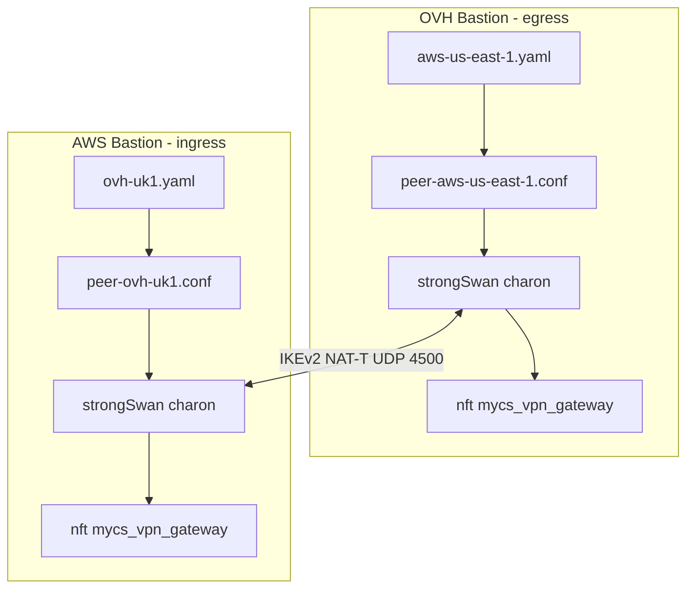
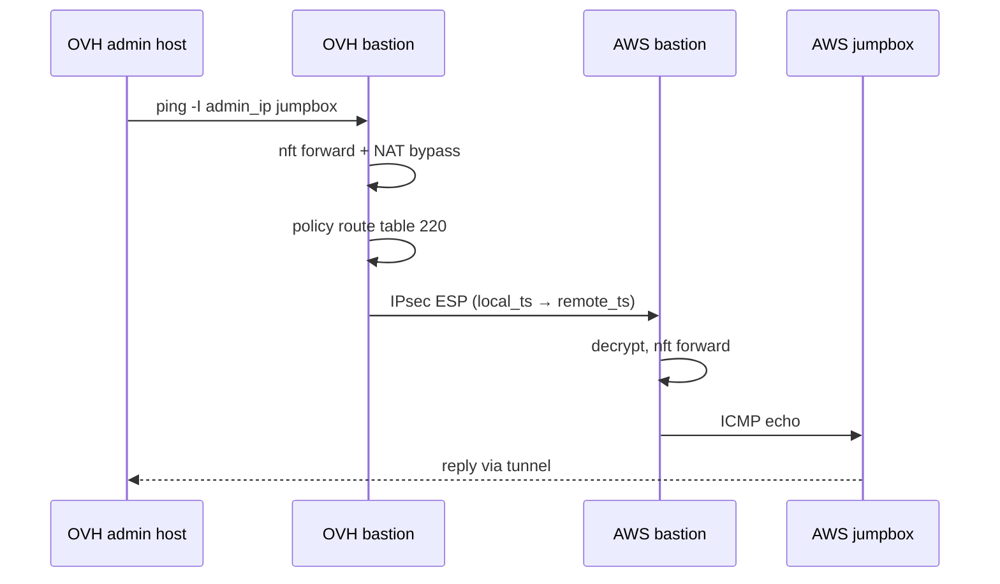

# Bastion VPN Gateway Design (Site-to-Site IPsec)

This document describes the **VPN gateway** subsystem: multi-peer site-to-site IPsec between bastions using StrongSwan swanctl, runtime peer YAML, nftables forward policy, NAT bypass, and policy routing.

Road-warrior (client-to-site) VPN is documented in [vpn-design.md](vpn-design.md). Network forwarding context is in [network-design.md](network-design.md).

---

## Table of Contents

1. [Overview](#overview)
2. [Architecture](#architecture)
3. [Configuration Model](#configuration-model)
4. [Peer YAML Schema](#peer-yaml-schema)
5. [Scripts and Files](#scripts-and-files)
6. [strongSwan Per-Peer Configuration](#strongswan-per-peer-configuration)
7. [Traffic Selectors and Directions](#traffic-selectors-and-directions)
8. [nftables and NAT Bypass](#nftables-and-nat-bypass)
9. [Policy Routing and Admin Routes](#policy-routing-and-admin-routes)
10. [Runtime Management](#runtime-management)
11. [Multi-Cloud Peering Example (OVH ↔ AWS)](#multi-cloud-peering-example-ovh--aws)
12. [Terraform Integration](#terraform-integration)
13. [Troubleshooting](#troubleshooting)

---

## Overview

The VPN gateway allows a bastion to establish **site-to-site IPsec tunnels** to remote bastions or upstream gateways. Unlike road-warrior VPN (`vpn.type`), gateway peers are:

- Defined in **per-peer YAML files** under `/data/strongswan/peers/`
- Managed at runtime via `manage_vpn_gateway_peer` (no image rebuild required)
- Independent of which road-warrior protocol (if any) is enabled

Typical use case: OVH OpenStack bastion (egress) ↔ AWS bastion (ingress), bridging admin subnets and optionally road-warrior client subnets.

---

## Architecture





---

## Configuration Model

### Global settings (`/etc/mycs/config.yml`)

Terraform (`cloud-inceptor/modules/bastion-config`) emits a minimal block:

```yaml
vpn_gateway:
  enabled: yes
  protocol: ipsec
  local_id: test-uk1.ovh.NnovAassist.ai   # bastion FQDN
```

| Key | Purpose |
|-----|---------|
| `enabled` | `yes` runs `configure_vpn_gateway` bootstrap |
| `protocol` | `ipsec` (only supported value) |
| `local_id` | Local IKE identity for all peers |

Additional global IKE/ESP defaults may be present in config or use script defaults (`aes256`, `sha256`, modp2048, etc.).

### Peer settings (`/data/strongswan/peers/<name>.yaml`)

All peer-specific parameters (remote host, CIDRs, direction, auth, CA) live in peer YAML, not Terraform.

---

## Peer YAML Schema

Required keys: `name`, `host`, `local_cidr`, `remote_cidr`, `direction`, `auth`

| Field | Required | Description |
|-------|----------|-------------|
| `name` | yes | Local peer identifier |
| `host` | yes | Remote gateway FQDN or IP (`remote_addrs`) |
| `remote_id` | no | Remote IKE identity (defaults to `host`) |
| `local_cidr` | yes | Local traffic selector (e.g. admin subnet `/26`) |
| `remote_cidr` | yes | Remote traffic selector (peer admin subnet) |
| `remote_peer_vpn_subnet` | no | Remote bastion's road-warrior subnet; required on **ingress** peers for cross-site client access |
| `direction` | yes | `egress`, `ingress`, or `bidirectional` |
| `auth` | yes | `cert` or `psk` |
| `psk` | if auth=psk | Pre-shared key |
| `remote_ca` | if auth=cert | Filename under `/data/strongswan/x509ca/` |
| `remote_ca_pem` | no | Inline PEM staged on `add` |

### Example — OVH egress peer

File: `cloud-inceptor/examples/inceptor/openstack/.UK1/aws-use1-peer.yml`

```yaml
name: aws-us-east-1
host: test-us-east-1.aws.NnovAassist.ai
remote_id: test-us-east-1.aws.NnovAassist.ai
local_cidr: 172.20.64.128/26
remote_cidr: 172.20.9.192/26
direction: egress
auth: cert
remote_ca: aws-root-ca.pem
remote_ca_pem: |
  -----BEGIN CERTIFICATE-----
  ...
  -----END CERTIFICATE-----
```

Egress peers automatically expand `local_ts` to include local road-warrior subnet (`config_vpn_subnet`) when road-warrior VPN is enabled.

### Example — AWS ingress peer

File: `cloud-inceptor/examples/inceptor/aws/.us-east-1/ovh-uk1-peer.yml`

```yaml
name: ovh-uk1
host: test-uk1.ovh.NnovAassist.ai
remote_id: test-uk1.ovh.NnovAassist.ai
local_cidr: 172.20.9.192/26
remote_cidr: 172.20.64.128/26
remote_peer_vpn_subnet: 192.168.111.0/24   # OVH road-warrior subnet
direction: ingress
auth: cert
remote_ca: ovh-root-ca.pem
remote_ca_pem: |
  -----BEGIN CERTIFICATE-----
  ...
  -----END CERTIFICATE-----
```

---

## Scripts and Files

| Script / file | Role |
|---------------|------|
| `configure_vpn_gateway` | Bootstrap: dirs, systemd units, apply existing peers |
| `manage_vpn_gateway_peer` | CLI: add, remove, list, apply |
| `vpn_gateway_common` | Shared library (peer load, swanctl render, nft, NAT bypass) |
| `cloud-inceptor-vpn-gateway-peers.service` | Boot: reload nft, NAT bypass, policy routing |

| Path | Purpose |
|------|---------|
| `/data/strongswan/peers/<name>.yaml` | Peer definitions |
| `/data/strongswan/etc/conf.d/peer-<name>.conf` | Rendered swanctl fragment |
| `/data/strongswan/etc/swanctl.conf` | Includes `conf.d/*` |
| `/data/network/etc/vpn-gateway-peers.nft` | `inet mycs_vpn_gateway` forward rules |
| `/usr/local/etc/.vpn_gateway_installed` | Bootstrap marker |

---

## strongSwan Per-Peer Configuration

Each peer renders to connection `vpn-gateway-<sanitized-name>` with child SA `<name>-net`.

Example fragment (OVH egress):

```
aws-us-east-1-net {
  local_ts = 172.20.64.128/26,192.168.111.0/24
  remote_ts = 172.20.9.192/26
  start_action = start
  ...
}
```

Example fragment (AWS ingress with road-warrior):

```
ovh-uk1-net {
  local_ts = 172.20.9.192/26
  remote_ts = 172.20.64.128/26,192.168.111.0/24
  start_action = none
  ...
}
```

After `manage_vpn_gateway_peer apply`:

```bash
swanctl --load-all
# egress/bidirectional: auto-initiate
swanctl --initiate --child <name>-net --ike vpn-gateway-<name>
```

---

## Traffic Selectors and Directions

| Direction | `start_action` | Initiator | Forward policy |
|-----------|----------------|-----------|----------------|
| `egress` | `start` | This bastion | NEW local → remote; return remote → local |
| `ingress` | `none` | Remote peer | NEW remote → local; return local → remote |
| `bidirectional` | `start` | Either | NEW both ways |

### Road-warrior cross-site access

For OVH VPN clients to reach AWS admin hosts:

| Side | Selector expansion |
|------|-------------------|
| OVH egress | `local_ts` += `config_vpn_subnet` (automatic) |
| AWS ingress | `remote_ts` += `remote_peer_vpn_subnet` (must be in peer YAML) |

IKE negotiates the **intersection** of both sides' proposals. If AWS `remote_ts` omits `192.168.111.0/24`, the CHILD SA will not carry road-warrior traffic even if OVH proposes it.

---

## nftables and NAT Bypass

### Forward table `inet mycs_vpn_gateway`

Generated by `vpn_gateway_regenerate_nft`. Rules depend on peer `direction` and include road-warrior CIDRs for egress/bidirectional peers.

### NAT bypass (`ip mycs_nat postrouting`)

`vpn_gateway_refresh_nat_bypass` inserts rules with comment `vpn-gateway-nat-bypass` at **chain head** (position 0):

```nft
ip saddr 172.20.64.128/26 ip daddr 172.20.9.192/26 accept comment "vpn-gateway-nat-bypass"
ip saddr 192.168.111.0/24 ip daddr 172.20.9.192/26 accept comment "vpn-gateway-nat-bypass"
```

Without bypass, masquerade on the DMZ interface rewrites source IPs before IPsec policy matching, causing tunnel traffic to fail silently (0 bytes in SA counters).

Verify:

```bash
nft -a list chain ip mycs_nat postrouting | grep vpn-gateway
```

### Docker DOCKER-USER

`vpn_gateway_refresh_docker_user_forward` adds bypass rules for peer local CIDR and road-warrior subnet.

---

## Policy Routing and Admin Routes

### Policy routing (table 220)

strongSwan installs policy routes in table 220. The bastion ensures:

```bash
ip rule add pref 220 from all lookup 220
```

via `vpn_gateway_ensure_policy_routing` on apply and at boot.

Check:

```bash
ip rule list
ip route show table 220
```

### Admin supernet route removal

Cloud providers may install `172.16.0.0/12 via <admin-gateway>` on the admin NIC, stealing routes to peer CIDRs.

Fixes:

1. **Terraform**: when `bastion_as_nat=true`, admin NIC netplan omits the supernet static route.
2. **Runtime**: `vpn_gateway_remove_admin_supernet_routes` deletes conflicting static routes on boot/apply.

Check:

```bash
ip route | grep 172.16
ip route show dev ens4   # admin NIC name varies
```

---

## Runtime Management

```bash
sudo manage_vpn_gateway_peer add /path/to/peer.yaml
sudo manage_vpn_gateway_peer list
sudo manage_vpn_gateway_peer remove <name>
sudo manage_vpn_gateway_peer apply
```

`apply` regenerates all peer conf files, nftables, NAT bypass, Docker rules, reloads swanctl, ensures policy routing, removes admin supernet routes, and **initiates egress/bidirectional peers** (with 1s delay after load).

### apply workflow (vpn_gateway_apply_all)

```
vpn_gateway_regenerate_all_peer_confs
vpn_gateway_regenerate_nft
vpn_gateway_refresh_nat_bypass
vpn_gateway_refresh_docker_user_forward
vpn_gateway_sync_and_load        # swanctl --load-all
vpn_gateway_ensure_policy_routing
vpn_gateway_remove_admin_supernet_routes
vpn_gateway_initiate_egress_peers
```

---

## Multi-Cloud Peering Example (OVH ↔ AWS)

Validated topology:

| | OVH (UK1) | AWS (us-east-1) |
|--|-----------|-----------------|
| Role | egress initiator | ingress responder |
| DMZ IP | 172.20.64.125 | 172.20.8.125 |
| Admin IP | 172.20.64.189 | 172.20.9.253 |
| Admin CIDR | 172.20.64.128/26 | 172.20.9.192/26 |
| Road-warrior | 192.168.111.0/24 | 192.168.111.0/24 |
| Jumpbox | 172.20.64.133 | 172.20.9.249 |

**Deploy order:**

1. Apply AWS ingress peer YAML first (so `remote_ts` includes OVH road-warrior subnet).
2. Apply OVH egress peer YAML (initiates tunnel).
3. Verify both sides: `swanctl --list-sas`

**Reachability tests:**

```bash
# From OVH bastion — use admin source IP
ping -I 172.20.64.189 -c2 172.20.9.249

# From OVH road-warrior client
ping 172.20.9.249
```

---

## Terraform Integration

`cloud-inceptor` provides:

- Minimal `vpn_gateway` block in bastion config (enabled, protocol, local_id)
- `vpn_gateway_peer_cidrs` to bootstrap modules for security group ingress from remote peer admin CIDRs
- Admin NIC netplan fix when `bastion_as_nat=true` (no supernet route)

Peer YAML and `manage_vpn_gateway_peer add` are operational steps after instance launch.

Example peer files:

- `cloud-inceptor/examples/inceptor/openstack/.UK1/aws-use1-peer.yml`
- `cloud-inceptor/examples/inceptor/aws/.us-east-1/ovh-uk1-peer.yml`

---

## Troubleshooting

### Full diagnostic (run as root on each bastion)

```bash
echo "=== $(hostname) $(date -u) ==="

echo "--- strongswan ---"
systemctl is-active strongswan
ls -la /var/run/charon.vici

echo "--- peers ---"
manage_vpn_gateway_peer list
ls -la /data/strongswan/peers/
grep -A6 '\-net' /data/strongswan/etc/conf.d/peer-*.conf

echo "--- swanctl ---"
swanctl --list-conns | grep -E 'vpn-gateway|net:'
swanctl --list-sas
swanctl --list-pols 2>/dev/null | head -20

echo "--- routing ---"
ip route | grep -E '172\.(16|20)|default'
ip rule list
ip route show table 220 2>/dev/null
ip xfrm policy | grep -E '172\.20|192\.168'

echo "--- nft NAT bypass ---"
nft -a list chain ip mycs_nat postrouting | grep -E 'vpn-gateway|172\.|192\.168' | head -10
nft list table inet mycs_vpn_gateway 2>/dev/null | head -30

echo "--- initiate (egress only) ---"
# swanctl --initiate --child <peer>-net --ike vpn-gateway-<peer>
# sleep 2
# swanctl --list-sas

echo "--- reachability ---"
ping -c1 -W2 <local_dmz_ip> >/dev/null && echo "DMZ ok" || echo "DMZ fail"
ping -I <admin_ip> -c2 -W2 <remote_jumpbox_ip>

echo "--- charon log ---"
journalctl -u strongswan -n 40 --no-pager
```

### Issue: swanctl --list-sas empty

| Cause | Resolution |
|-------|------------|
| Not running as root | Use `sudo swanctl --list-sas` |
| Egress peer not initiated | `manage_vpn_gateway_peer apply` or manual `swanctl --initiate` |
| Config not loaded | `swanctl --load-all`; check `journalctl -u strongswan` |
| No peer YAML | `manage_vpn_gateway_peer list` |

### Issue: SA up but 0 bytes/packets

| Cause | Resolution |
|-------|------------|
| NAT masquerade before bypass | `manage_vpn_gateway_peer apply`; verify `vpn-gateway-nat-bypass` at top of postrouting |
| Wrong ping source IP | `ping -I <admin_ip_in_local_ts> ...` |
| Admin supernet route | `ip route show dev <admin_nic>`; apply Terraform fix + `vpn_gateway_remove_admin_supernet_routes` |
| Traffic selector mismatch | Compare `grep local_ts/remote_ts` in peer conf vs `swanctl --list-sas` |

### Issue: admin ping works, road-warrior does not

| Cause | Resolution |
|-------|------------|
| Ingress missing `remote_peer_vpn_subnet` | Add to ingress peer YAML, re-apply on AWS |
| Negotiated SA missing VPN subnet | `swanctl --list-sas` — re-initiate after both sides updated |
| nft forward missing VPN CIDR | `nft list table inet mycs_vpn_gateway` |

### Issue: CHILD_SA TS narrowed vs config file

Log example:

```
CHILD_SA aws-us-east-1-net{3} established with TS 172.20.64.128/26 === 172.20.9.192/26
```

Config file may show `local_ts = 172.20.64.128/26,192.168.111.0/24` but negotiated SA excludes road-warrior subnet because remote peer did not accept it. Fix remote `remote_ts` / `remote_peer_vpn_subnet` on ingress side.

### Re-apply all gateway config

```bash
sudo manage_vpn_gateway_peer apply
sudo swanctl --list-sas
```

### Re-run bootstrap

```bash
sudo rm -f /usr/local/etc/.vpn_gateway_installed
sudo /usr/local/lib/cloud-inceptor/configure_vpn_gateway 2>&1 | tee /var/log/configure_vpn_gateway.log
```

### Init log

```bash
sudo cat /var/log/configure_vpn_gateway.log
```

---

## Related Documentation

- [network-design.md](network-design.md) — nftables, routing, Docker bypass
- [vpn-design.md](vpn-design.md) — Road-warrior StrongSwan server
- [runtime-bootstrap-design.md](runtime-bootstrap-design.md) — init_instance order
