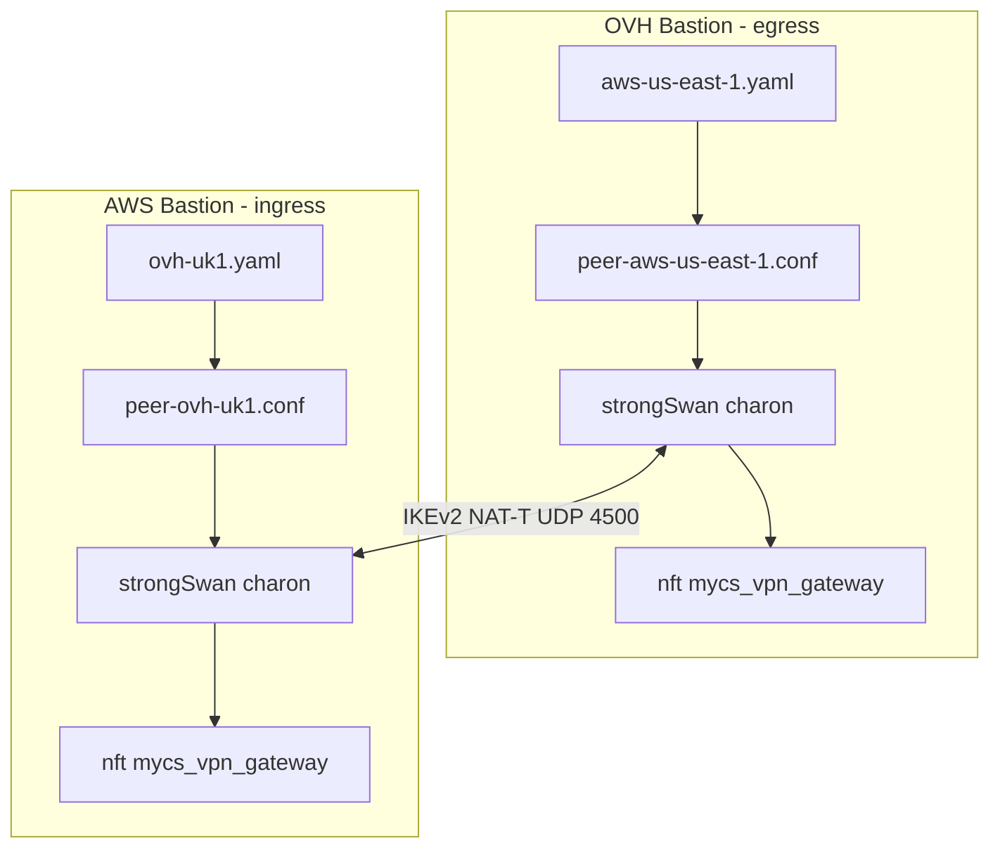
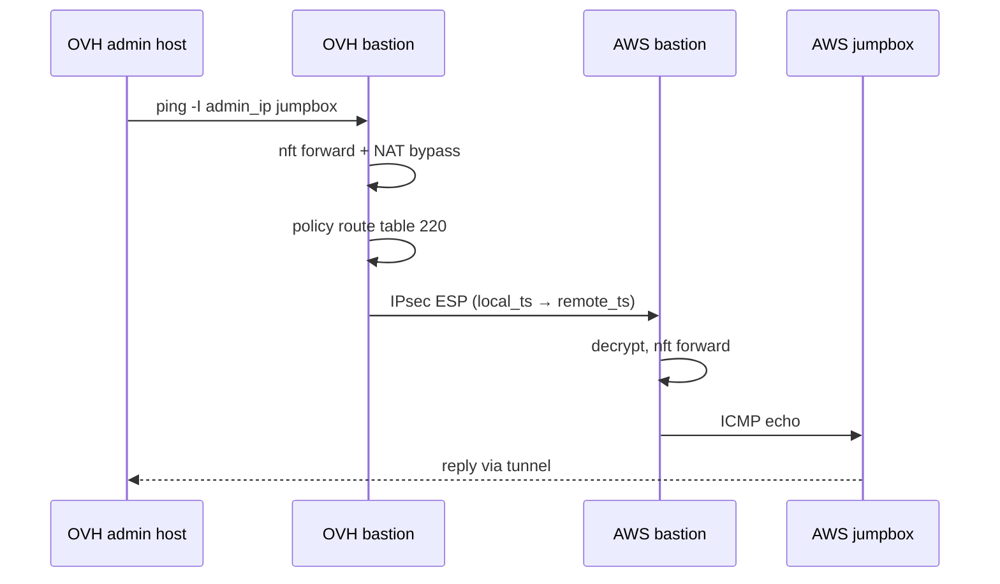
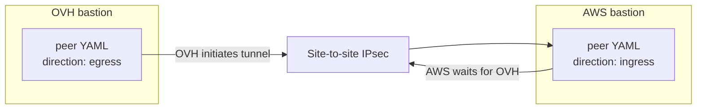
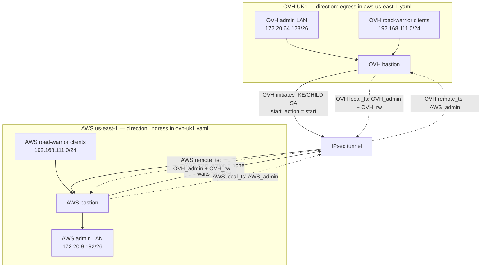
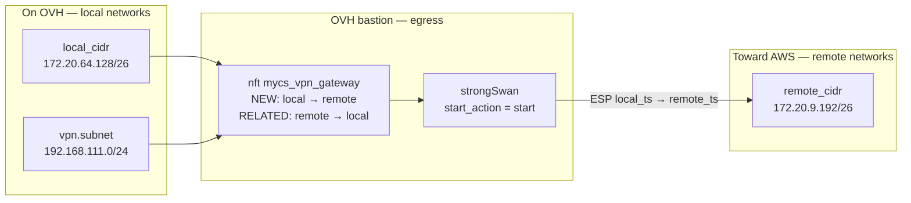
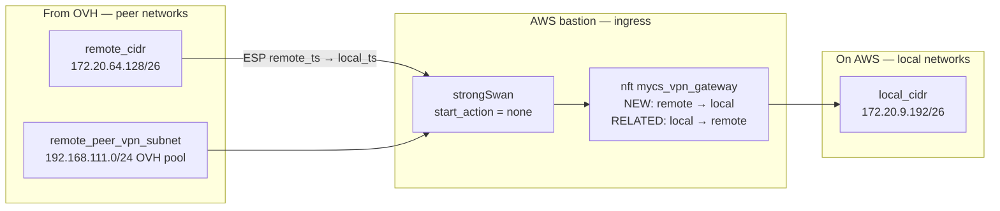
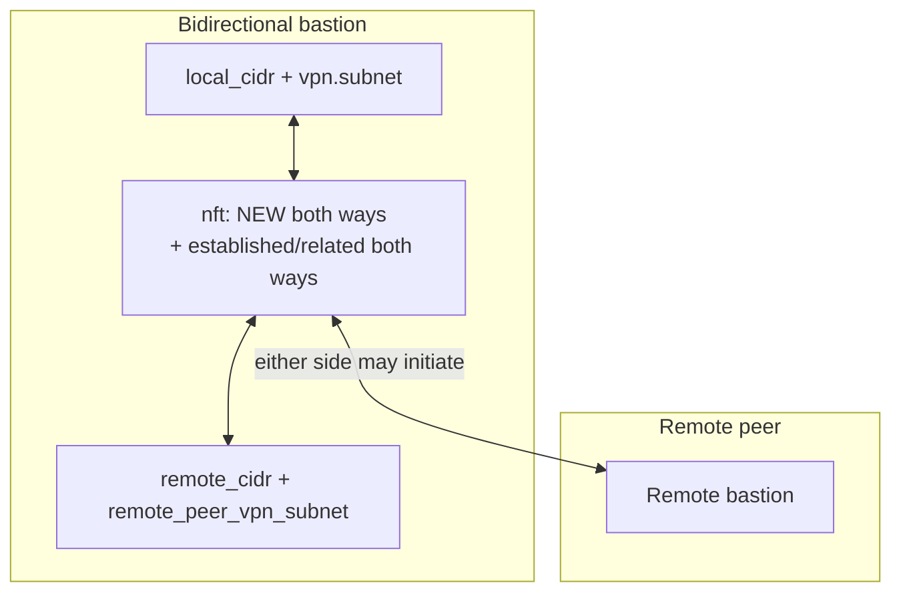
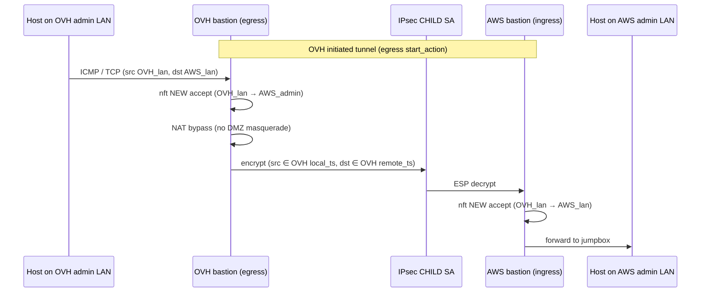
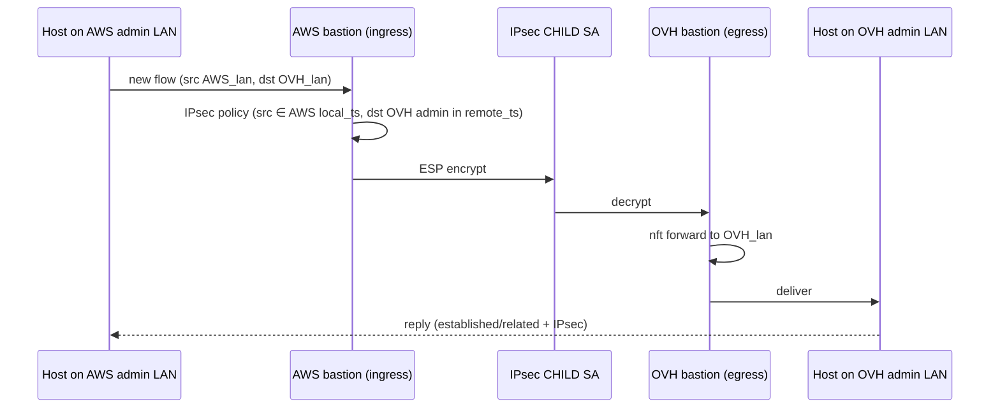

# Bastion VPN Gateway Design (Site-to-Site IPsec)

This document describes the **VPN gateway** subsystem: multi-peer site-to-site IPsec between bastions using StrongSwan swanctl, runtime peer YAML, nftables forward policy, NAT bypass, and policy routing.

Road-warrior (client-to-site) VPN is documented in [vpn-design.md](vpn-design.md). Network forwarding context is in [network-design.md](network-design.md). Additional connectivity scenarios and variants are in [ipsec-vpn-connectivity-design.md](ipsec-vpn-connectivity-design.md).

---

## Table of Contents

1. [Overview](#overview)
2. [Architecture](#architecture)
3. [Configuration Model](#configuration-model)
4. [Peer YAML Schema](#peer-yaml-schema)
5. [Scripts and Files](#scripts-and-files)
6. [strongSwan Per-Peer Configuration](#strongswan-per-peer-configuration)
7. [Traffic Selectors and Directions](#traffic-selectors-and-directions)
   - [Reference topology (OVH egress ↔ AWS ingress)](#reference-topology-ovh-egress--aws-ingress)
   - [How ingress and egress peers work together](#how-ingress-and-egress-peers-work-together)
   - [Per-direction behaviour](#per-direction-behaviour)
   - [Paired egress + ingress: end-to-end flows](#paired-egress--ingress-end-to-end-flows)
   - [Reachability matrix](#reachability-matrix)
   - [Road-warrior cross-site access](#road-warrior-cross-site-access)
8. [nftables and NAT Bypass](#nftables-and-nat-bypass)
9. [Policy Routing and Admin Routes](#policy-routing-and-admin-routes)
10. [Runtime Management](#runtime-management)
11. [Multi-Cloud Peering Example (OVH ↔ AWS)](#multi-cloud-peering-example-ovh--aws)
12. [Terraform Integration](#terraform-integration)
13. [Troubleshooting](#troubleshooting)

---

## Overview

The VPN gateway allows a bastion to establish **site-to-site IPsec tunnels** to remote bastions or upstream gateways. Unlike road-warrior VPN (`vpn.type`), gateway peers are:

- Defined in **per-peer YAML files** under `/data/strongswan/peers/`
- Managed at runtime via `manage_vpn_gateway_peer` (no image rebuild required)
- Independent of which road-warrior protocol (if any) is enabled

Typical use case: OVH OpenStack bastion (egress) ↔ AWS bastion (ingress), bridging admin subnets and optionally road-warrior client subnets.

---

## Architecture





---

## Configuration Model

### Global settings (`/etc/mycs/config.yml`)

Terraform (`cloud-inceptor/modules/bastion-config`) emits a minimal block:

```yaml
vpn_gateway:
  enabled: yes
  protocol: ipsec
  local_id: test-uk1.ovh.NnovAassist.ai   # bastion FQDN
```

| Key | Purpose |
|-----|---------|
| `enabled` | `yes` runs `configure_vpn_gateway` bootstrap |
| `protocol` | `ipsec` (only supported value) |
| `local_id` | Local IKE identity for all peers |

Additional global IKE/ESP defaults may be present in config or use script defaults (`aes256`, `sha256`, modp2048, etc.).

### Peer settings (`/data/strongswan/peers/<name>.yaml`)

All peer-specific parameters (remote host, CIDRs, direction, auth, CA) live in peer YAML, not Terraform.

### Who is egress and who is ingress?

`direction` is set **separately on each bastion** in **that bastion's** peer file. There is no shared “link direction” — you choose a role per node.

For the standard **OVH ↔ AWS** test/production layout:

| Bastion | Cloud | `direction` in **this node's** peer YAML | Peer file (on this node) | Points at |
|---------|-------|------------------------------------------|--------------------------|-----------|
| **OVH UK1** | OpenStack | **`egress`** | `/data/strongswan/peers/aws-us-east-1.yaml` | AWS bastion |
| **AWS us-east-1** | AWS | **`ingress`** | `/data/strongswan/peers/ovh-uk1.yaml` | OVH bastion |



- **OVH** runs `direction: egress` → `start_action = start` → OVH calls `swanctl --initiate` on apply.
- **AWS** runs `direction: ingress` → `start_action = none` → AWS does **not** initiate; it accepts IKE from OVH.

Deploy **ingress (AWS) first**, then **egress (OVH)**, so AWS `remote_ts` is loaded before OVH brings the tunnel up.

Throughout [§ Traffic Selectors and Directions](#traffic-selectors-and-directions), **OVH = egress** and **AWS = ingress** unless stated otherwise. Generic labels **A** / **B** mean the same pairing: A = egress side, B = ingress side.

---

## Peer YAML Schema

Required keys: `name`, `host`, `local_cidr`, `remote_cidr`, `direction`, `auth`

| Field | Required | Description |
|-------|----------|-------------|
| `name` | yes | Local peer identifier |
| `host` | yes | Remote gateway FQDN or IP (`remote_addrs`) |
| `remote_id` | no | Remote IKE identity (defaults to `host`) |
| `local_cidr` | yes | Local traffic selector (e.g. admin subnet `/26`) |
| `remote_cidr` | yes | Remote traffic selector (peer admin subnet) |
| `remote_peer_vpn_subnet` | no | Remote bastion's road-warrior subnet; required on **ingress** peers for cross-site client access |
| `direction` | yes | `egress`, `ingress`, or `bidirectional` |
| `auth` | yes | `cert` or `psk` |
| `psk` | if auth=psk | Pre-shared key |
| `remote_ca` | if auth=cert | Filename under `/data/strongswan/x509ca/` |
| `remote_ca_pem` | no | Inline PEM staged on `add` |

### Example — OVH bastion peer file (`direction: egress`)

**Runs on:** OVH UK1 bastion. **Remote peer:** AWS us-east-1.

File: `cloud-inceptor/examples/inceptor/openstack/.UK1/aws-use1-peer.yml`

```yaml
name: aws-us-east-1
host: test-us-east-1.aws.NnovAassist.ai
remote_id: test-us-east-1.aws.NnovAassist.ai
local_cidr: 172.20.64.128/26
remote_cidr: 172.20.9.192/26
direction: egress
auth: cert
remote_ca: aws-root-ca.pem
remote_ca_pem: |
  -----BEGIN CERTIFICATE-----
  ...
  -----END CERTIFICATE-----
```

Egress peers automatically expand `local_ts` to include local road-warrior subnet (`config_vpn_subnet`) when road-warrior VPN is enabled.

### Example — AWS bastion peer file (`direction: ingress`)

**Runs on:** AWS us-east-1 bastion. **Remote peer:** OVH UK1.

File: `cloud-inceptor/examples/inceptor/aws/.us-east-1/ovh-uk1-peer.yml`

```yaml
name: ovh-uk1
host: test-uk1.ovh.NnovAassist.ai
remote_id: test-uk1.ovh.NnovAassist.ai
local_cidr: 172.20.9.192/26
remote_cidr: 172.20.64.128/26
remote_peer_vpn_subnet: 192.168.111.0/24   # OVH road-warrior subnet
direction: ingress
auth: cert
remote_ca: ovh-root-ca.pem
remote_ca_pem: |
  -----BEGIN CERTIFICATE-----
  ...
  -----END CERTIFICATE-----
```

---

## Scripts and Files

| Script / file | Role |
|---------------|------|
| `configure_vpn_gateway` | Bootstrap: dirs, systemd units, apply existing peers |
| `manage_vpn_gateway_peer` | CLI: add, remove, list, apply |
| `vpn_gateway_common` | Shared library (peer load, swanctl render, nft, NAT bypass) |
| `cloud-inceptor-vpn-gateway-peers.service` | Boot: reload nft, NAT bypass, policy routing |

| Path | Purpose |
|------|---------|
| `/data/strongswan/peers/<name>.yaml` | Peer definitions |
| `/data/strongswan/etc/conf.d/peer-<name>.conf` | Rendered swanctl fragment |
| `/data/strongswan/etc/swanctl.conf` | Includes `conf.d/*` |
| `/data/network/etc/vpn-gateway-peers.nft` | `inet mycs_vpn_gateway` forward rules |
| `/usr/local/etc/.vpn_gateway_installed` | Bootstrap marker |

---

## strongSwan Per-Peer Configuration

Each peer renders to connection `vpn-gateway-<sanitized-name>` with child SA `<name>-net`.

Example fragment (OVH egress):

```
aws-us-east-1-net {
  local_ts = 172.20.64.128/26,192.168.111.0/24
  remote_ts = 172.20.9.192/26
  start_action = start
  ...
}
```

Example fragment (AWS ingress with road-warrior):

```
ovh-uk1-net {
  local_ts = 172.20.9.192/26
  remote_ts = 172.20.64.128/26,192.168.111.0/24
  start_action = none
  ...
}
```

After `manage_vpn_gateway_peer apply`:

```bash
swanctl --load-all
# egress/bidirectional: auto-initiate
swanctl --initiate --child <name>-net --ike vpn-gateway-<name>
```

---

## Traffic Selectors and Directions

### Reference topology (OVH egress ↔ AWS ingress)

All flow diagrams below use this pairing unless noted. Each row is **one physical bastion** and the `direction` value that must appear in **its own** peer YAML.

| | **OVH UK1** (egress) | **AWS us-east-1** (ingress) |
|--|----------------------|-----------------------------|
| **`direction`** | `egress` | `ingress` |
| **Initiates tunnel?** | Yes (`swanctl --initiate`) | No (waits for OVH) |
| **Admin CIDR (`local_cidr`)** | `172.20.64.128/26` | `172.20.9.192/26` |
| **Peer admin CIDR (`remote_cidr`)** | `172.20.9.192/26` (AWS) | `172.20.64.128/26` (OVH) |
| **Road-warrior pool** | `192.168.111.0/24` (local clients) | `192.168.111.0/24` (local clients) |
| **`remote_peer_vpn_subnet`** | not required on egress | `192.168.111.0/24` (OVH's pool) |
| **Example peer file on this node** | `aws-us-east-1-peer.yml` | `ovh-uk1-peer.yml` |

When this doc uses **A** or **B**: **A = OVH (egress)**, **B = AWS (ingress)**.

Additional reachability variants: [ipsec-vpn-connectivity-design.md](ipsec-vpn-connectivity-design.md).

### How ingress and egress peers work together

The tunnel is two complementary halves. **OVH** proposes “my networks may send toward AWS admin”; **AWS** proposes “I accept traffic from OVH admin ± OVH road-warrior toward my admin”:



| On **this** bastion | `egress` (OVH) | `ingress` (AWS) | `bidirectional` |
|---------------------|----------------|-----------------|-----------------|
| **IKE `start_action`** | `start` — initiates CHILD SA | `none` — waits for remote | `start` — may initiate |
| **Who brings tunnel up first** | This bastion (OVH) | Remote bastion (OVH) | Either side |
| **nftables NEW forward** | Local → remote | Remote → local | Both |
| **`local_ts`** | `local_cidr` + local `vpn.subnet` (if road-warrior enabled) | `local_cidr` only | Same as egress |
| **`remote_ts`** | `remote_cidr` only | `remote_cidr` + `remote_peer_vpn_subnet` | Same as ingress |

**Egress (OVH):** OVH may **start** the tunnel. **New** flows from OVH admin and OVH road-warrior clients toward AWS `remote_cidr` are permitted by nftables and proposed in OVH's `local_ts`.

**Ingress (AWS):** AWS **does not** start the tunnel; it accepts IKE from OVH. **New** flows from OVH networks (admin ± OVH road-warrior) toward AWS `local_cidr` are permitted and proposed in AWS's `remote_ts`.

**Bidirectional:** same bastion both initiates and accepts new flows in both directions (not the default OVH/AWS layout).

### Per-direction behaviour

#### Egress (initiator side — OVH in reference topology)

Applies to the bastion whose peer YAML contains `direction: egress` (OVH in the OVH ↔ AWS layout).



- **Initiation:** `manage_vpn_gateway_peer apply` runs `swanctl --initiate` for egress peers.
- **Selectors:** `local_ts` = `local_cidr` (+ local road-warrior subnet when `vpn:` is enabled). `remote_ts` = `remote_cidr` only.
- **Forwarding:** nft allows **new** connections from each egress source CIDR to `remote_cidr`, and **established/related** return traffic from `remote_cidr` back to `local_cidr` (and road-warrior pool for return).

#### Ingress (responder side — AWS in reference topology)

Applies to the bastion whose peer YAML contains `direction: ingress` (AWS in the OVH ↔ AWS layout).



- **Initiation:** does not auto-initiate; waits for the egress (or bidirectional) peer.
- **Selectors:** `local_ts` = `local_cidr` only. `remote_ts` = `remote_cidr` + `remote_peer_vpn_subnet` (when set).
- **Forwarding:** nft allows **new** connections from each remote source CIDR to `local_cidr`, and **established/related** return from `local_cidr` to those remote CIDRs.
- **Important:** ingress does **not** add the **local** road-warrior pool to `local_ts`. Local VPN clients on an ingress-only bastion cannot originate site-to-site flows to the peer without changing direction to `bidirectional` (or `egress`).

#### Bidirectional (either side may initiate)



- Combines egress initiation with ingress acceptance on the **same** peer entry.
- Use when both sites must initiate tunnels, or when local road-warrior clients on **both** sides need to reach the remote admin LAN.
- Both sides `bidirectional` is valid but may produce duplicate CHILD_SA log lines if both initiate; usually harmless if an SA is already up.

### Paired egress + ingress: end-to-end flows (OVH ↔ AWS)

**OVH** peer file: `direction: egress`. **AWS** peer file: `direction: ingress`.

**Deploy order:** apply **AWS (ingress)** first, then **OVH (egress)** so AWS `remote_ts` is ready before OVH initiates.

#### Flow 1 — OVH admin host → AWS admin host

| Node | Role | What happens |
|------|------|--------------|
| **OVH** | `egress` | Forwards, encrypts (initiator side) |
| **AWS** | `ingress` | Decrypts, forwards to AWS LAN |



#### Flow 2 — AWS admin host → OVH admin host

| Node | Role | What happens |
|------|------|--------------|
| **AWS** | `ingress` | Encrypts outbound using AWS local_ts / remote_ts |
| **OVH** | `egress` | Decrypts, forwards to OVH LAN |



Admin ↔ admin reachability is **symmetric** with **OVH egress + AWS ingress** once the CHILD SA is up.

#### Flow 3 — OVH road-warrior client → AWS admin host

| Node | Role | Selector requirement |
|------|------|----------------------|
| **OVH** | `egress` | `local_ts` must include `192.168.111.0/24` (OVH road-warrior pool) |
| **AWS** | `ingress` | `remote_ts` must include `192.168.111.0/24` via `remote_peer_vpn_subnet` (OVH's pool) |

The client connects to **OVH** via road-warrior VPN (`ikev2-eap-tls`). Cross-site traffic then uses the **site-to-site** tunnel that **OVH (egress)** initiated toward **AWS (ingress)**:


If **AWS (ingress)** omits OVH's road-warrior subnet from `remote_ts`, IKE negotiates **admin-only** selectors even though **OVH (egress)** lists `192.168.111.0/24` in `local_ts`. Verify with `swanctl --list-sas` on both nodes.

#### What does not work with OVH egress + AWS ingress alone

| Source | Destination | Works? | Why |
|--------|-------------|--------|-----|
| AWS road-warrior | OVH admin | **No** | AWS is `ingress` only — `local_ts` is AWS admin; AWS_rw cannot originate site-to-site |
| AWS road-warrior | OVH road-warrior | **No** | Same; shared `vpn_network` is ambiguous |
| OVH road-warrior | AWS road-warrior | **No** | Not in site-to-site selectors for admin-only SA |

To allow **AWS** road-warrior clients to reach OVH, change the **AWS** peer YAML to `direction: bidirectional` (or `egress`).

### Reachability matrix

Assuming **OVH = egress**, **AWS = ingress**, tunnel up, routes and NAT bypass correct.

| Source | Destination | Site-to-site | Notes |
|--------|-------------|--------------|-------|
| OVH admin LAN | AWS admin LAN | Yes | Primary validated use case |
| AWS admin LAN | OVH admin LAN | Yes | Reverse flows via established SA |
| OVH road-warrior | AWS admin LAN | Sometimes | OVH `local_ts` + AWS `remote_ts` must include OVH_rw in negotiated SA |
| AWS road-warrior | OVH admin LAN | No | AWS is ingress — AWS_rw not in `local_ts` |
| OVH road-warrior | OVH admin LAN | Yes | Road-warrior plane on OVH (not gateway) |
| OVH road-warrior | AWS road-warrior | No | Shared pool / selector limits |

| OVH direction | AWS direction | Tunnel comes up? | Symmetric admin reachability |
|---------------|---------------|------------------|------------------------------|
| egress | ingress | OVH initiates | Yes |
| egress | egress | Both try `start` | Yes if SA establishes |
| ingress | ingress | Neither initiates | **No** |
| bidirectional | bidirectional | Either initiates | Yes |
| egress | bidirectional | Either | Yes |

### Road-warrior cross-site access

For OVH VPN clients to reach AWS admin hosts:

| Side | Selector expansion |
|------|-------------------|
| OVH egress / bidirectional | `local_ts` += `config_vpn_subnet` (automatic) |
| AWS ingress / bidirectional | `remote_ts` += `remote_peer_vpn_subnet` (from peer YAML) |

IKE negotiates the **intersection** of both sides' proposals. If AWS `remote_ts` omits `192.168.111.0/24`, the CHILD SA will not carry road-warrior traffic even if OVH proposes it.

#### Shared road-warrior subnet (`vpn_network`)

Bastions often use the same `vpn_network` (e.g. `192.168.111.0/24`) on each site. If `remote_peer_vpn_subnet` in the peer YAML equals the **local** road-warrior pool, it is **omitted from `remote_ts`** on apply (with a warning). Including it would make the site-to-site CHILD SA claim the local VPN pool in `remote_ts`, so replies to local road-warrior clients (notably DNS to the bastion admin IP) would be encrypted into the peer tunnel instead of returned on the road-warrior SA.

With the omission:

- Local road-warrior DNS and admin reachability keep working after bidirectional peers.
- Cross-site access from local road-warrior clients to **remote admin** hosts still works (`local_ts` still includes the local VPN pool).
- Cross-site **road-warrior-to-road-warrior** traffic is not supported when both sites share the same `vpn_network` (addresses are ambiguous across the tunnel).

---

## nftables and NAT Bypass

### Forward table `inet mycs_vpn_gateway`

Generated by `vpn_gateway_regenerate_nft`. Rules depend on peer `direction` and include road-warrior CIDRs for egress/bidirectional peers.

### NAT bypass (`ip mycs_nat postrouting`)

`vpn_gateway_refresh_nat_bypass` inserts rules with comment `vpn-gateway-nat-bypass` at **chain head** (position 0):

```nft
ip saddr 172.20.64.128/26 ip daddr 172.20.9.192/26 accept comment "vpn-gateway-nat-bypass"
ip saddr 192.168.111.0/24 ip daddr 172.20.9.192/26 accept comment "vpn-gateway-nat-bypass"
```

Without bypass, masquerade on the DMZ interface rewrites source IPs before IPsec policy matching, causing tunnel traffic to fail silently (0 bytes in SA counters).

Verify:

```bash
nft -a list chain ip mycs_nat postrouting | grep vpn-gateway
```

### Docker DOCKER-USER

`vpn_gateway_refresh_docker_user_forward` adds bypass rules for peer local CIDR and road-warrior subnet.

---

## Policy Routing and Admin Routes

### Policy routing (table 220)

strongSwan installs policy routes in table 220. The bastion ensures:

```bash
ip rule add pref 220 from all lookup 220
```

via `vpn_gateway_ensure_policy_routing` on apply and at boot.

Check:

```bash
ip rule list
ip route show table 220
```

### Admin supernet route removal

Cloud providers may install `172.16.0.0/12 via <admin-gateway>` on the admin NIC, stealing routes to peer CIDRs.

Fixes:

1. **Terraform**: when `bastion_as_nat=true`, admin NIC netplan omits the supernet static route.
2. **Runtime**: `vpn_gateway_remove_admin_supernet_routes` deletes conflicting static routes on boot/apply.

Check:

```bash
ip route | grep 172.16
ip route show dev ens4   # admin NIC name varies
```

---

## Runtime Management

```bash
sudo manage_vpn_gateway_peer add /path/to/peer.yaml
sudo manage_vpn_gateway_peer list
sudo manage_vpn_gateway_peer remove <name>
sudo manage_vpn_gateway_peer apply
```

`apply` regenerates all peer conf files, nftables, NAT bypass, Docker rules, reloads swanctl, ensures policy routing, removes admin supernet routes, and **initiates egress/bidirectional peers** (with 1s delay after load).

### apply workflow (vpn_gateway_apply_all)

```
vpn_gateway_regenerate_all_peer_confs
vpn_gateway_regenerate_nft
vpn_gateway_refresh_nat_bypass
vpn_gateway_refresh_docker_user_forward
vpn_gateway_sync_and_load        # swanctl --load-all
vpn_gateway_ensure_policy_routing
vpn_gateway_remove_admin_supernet_routes
vpn_gateway_initiate_egress_peers
```

---

## Multi-Cloud Peering Example (OVH ↔ AWS)

Validated topology:

| | OVH (UK1) | AWS (us-east-1) |
|--|-----------|-----------------|
| Role | egress initiator | ingress responder |
| DMZ IP | 172.20.64.125 | 172.20.8.125 |
| Admin IP | 172.20.64.189 | 172.20.9.253 |
| Admin CIDR | 172.20.64.128/26 | 172.20.9.192/26 |
| Road-warrior | 192.168.111.0/24 | 192.168.111.0/24 |
| Jumpbox | 172.20.64.133 | 172.20.9.249 |

**Deploy order:**

1. Apply AWS ingress peer YAML first (so `remote_ts` includes OVH road-warrior subnet).
2. Apply OVH egress peer YAML (initiates tunnel).
3. Verify both sides: `swanctl --list-sas`

**Reachability tests:**

```bash
# From OVH bastion — use admin source IP
ping -I 172.20.64.189 -c2 172.20.9.249

# From OVH road-warrior client
ping 172.20.9.249
```

---

## Terraform Integration

`cloud-inceptor` provides:

- Minimal `vpn_gateway` block in bastion config (enabled, protocol, local_id)
- `vpn_gateway_peer_cidrs` to bootstrap modules for security group ingress from remote peer admin CIDRs
- Admin NIC netplan fix when `bastion_as_nat=true` (no supernet route)

Peer YAML and `manage_vpn_gateway_peer add` are operational steps after instance launch.

Example peer files:

- `cloud-inceptor/examples/inceptor/openstack/.UK1/aws-use1-peer.yml`
- `cloud-inceptor/examples/inceptor/aws/.us-east-1/ovh-uk1-peer.yml`

---

## Troubleshooting

### Full diagnostic (run as root on each bastion)

```bash
echo "=== $(hostname) $(date -u) ==="

echo "--- strongswan ---"
systemctl is-active strongswan
ls -la /var/run/charon.vici

echo "--- peers ---"
manage_vpn_gateway_peer list
ls -la /data/strongswan/peers/
grep -A6 '\-net' /data/strongswan/etc/conf.d/peer-*.conf

echo "--- swanctl ---"
swanctl --list-conns | grep -E 'vpn-gateway|net:'
swanctl --list-sas
swanctl --list-pols 2>/dev/null | head -20

echo "--- routing ---"
ip route | grep -E '172\.(16|20)|default'
ip rule list
ip route show table 220 2>/dev/null
ip xfrm policy | grep -E '172\.20|192\.168'

echo "--- nft NAT bypass ---"
nft -a list chain ip mycs_nat postrouting | grep -E 'vpn-gateway|172\.|192\.168' | head -10
nft list table inet mycs_vpn_gateway 2>/dev/null | head -30

echo "--- initiate (egress only) ---"
# swanctl --initiate --child <peer>-net --ike vpn-gateway-<peer>
# sleep 2
# swanctl --list-sas

echo "--- reachability ---"
ping -c1 -W2 <local_dmz_ip> >/dev/null && echo "DMZ ok" || echo "DMZ fail"
ping -I <admin_ip> -c2 -W2 <remote_jumpbox_ip>

echo "--- charon log ---"
journalctl -u strongswan -n 40 --no-pager
```

### Issue: swanctl --list-sas empty

| Cause | Resolution |
|-------|------------|
| Not running as root | Use `sudo swanctl --list-sas` |
| Egress peer not initiated | `manage_vpn_gateway_peer apply` or manual `swanctl --initiate` |
| Config not loaded | `swanctl --load-all`; check `journalctl -u strongswan` |
| No peer YAML | `manage_vpn_gateway_peer list` |

### Issue: SA up but 0 bytes/packets

| Cause | Resolution |
|-------|------------|
| NAT masquerade before bypass | `manage_vpn_gateway_peer apply`; verify `vpn-gateway-nat-bypass` at top of postrouting |
| Wrong ping source IP | `ping -I <admin_ip_in_local_ts> ...` |
| Admin supernet route | `ip route show dev <admin_nic>`; apply Terraform fix + `vpn_gateway_remove_admin_supernet_routes` |
| Traffic selector mismatch | Compare `grep local_ts/remote_ts` in peer conf vs `swanctl --list-sas` |

### Issue: admin ping works, road-warrior does not

| Cause | Resolution |
|-------|------------|
| Ingress missing `remote_peer_vpn_subnet` | Add to ingress peer YAML, re-apply on AWS |
| Negotiated SA missing VPN subnet | `swanctl --list-sas` — re-initiate after both sides updated |
| nft forward missing VPN CIDR | `nft list table inet mycs_vpn_gateway` |

### Issue: road-warrior DNS times out after bidirectional peer

| Cause | Resolution |
|-------|------------|
| `remote_ts` included local `vpn_network` via matching `remote_peer_vpn_subnet` | Re-apply peers with current scripts; `remote_peer_vpn_subnet` equal to local pool is auto-omitted from `remote_ts` |
| DNS works on bastion but not VPN client | `dig @<admin_ip> jumpbox.<zone>.local` from client; confirm `swanctl --list-sas` `remote_ts` no longer lists the local VPN pool |

### Issue: CHILD_SA TS narrowed vs config file

Log example:

```
CHILD_SA aws-us-east-1-net{3} established with TS 172.20.64.128/26 === 172.20.9.192/26
```

Config file may show `local_ts = 172.20.64.128/26,192.168.111.0/24` but negotiated SA excludes road-warrior subnet because remote peer did not accept it. Fix remote `remote_ts` / `remote_peer_vpn_subnet` on ingress side.

### Re-apply all gateway config

```bash
sudo manage_vpn_gateway_peer apply
sudo swanctl --list-sas
```

### Re-run bootstrap

```bash
sudo rm -f /usr/local/etc/.vpn_gateway_installed
sudo /usr/local/lib/cloud-inceptor/configure_vpn_gateway 2>&1 | tee /var/log/configure_vpn_gateway.log
```

### Init log

```bash
sudo cat /var/log/configure_vpn_gateway.log
```

---

## Related Documentation

- [network-design.md](network-design.md) — nftables, routing, Docker bypass
- [vpn-design.md](vpn-design.md) — Road-warrior StrongSwan server
- [runtime-bootstrap-design.md](runtime-bootstrap-design.md) — init_instance order
